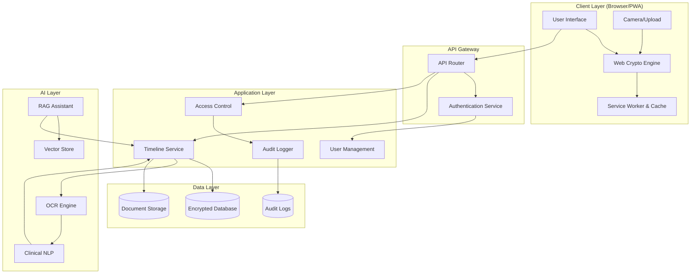

# Design Document: ArogyaSutra

## Overview

ArogyaSutra is a Zero-Knowledge encrypted Personal Health Record system that combines physical security (patient cards) with client-side encryption to give patients complete sovereignty over their medical data. The system uses AI to digitize paper medical documents, maintains a chronological health timeline, and provides emergency access protocols while ensuring the platform operator cannot access plaintext patient data.

The architecture follows a client-heavy model where all encryption/decryption happens in the browser using Web Crypto API. The backend serves as an encrypted data store with no access to decryption keys. AI processing for document digitization happens server-side on encrypted data streams, with results encrypted before storage.

## Architecture

### High-Level Architecture



### Security Architecture

The system implements a Zero-Knowledge architecture where:

1. **Client-Side Encryption**: All patient data is encrypted in the browser before transmission
2. **Key Derivation**: Master keys are derived from patient credentials using PBKDF2 and never leave the client
3. **Encrypted Storage**: Server stores only encrypted blobs with no access to plaintext
4. **Selective Decryption**: Emergency data uses a separate encryption scheme allowing break-glass access

### Data Flow

1. **Document Upload Flow**:
   - Patient captures photo → Client encrypts with Master_Key → Upload encrypted blob → Server stores encrypted → AI processes encrypted stream → Extracts metadata → Encrypts metadata → Stores encrypted metadata

2. **Timeline Retrieval Flow**:
   - Patient authenticates → Server sends encrypted timeline → Client decrypts with Master_Key → Display plaintext

3. **Doctor Access Flow**:
   - Patient grants access → System creates access token with re-encrypted data key → Doctor retrieves encrypted data → Doctor's client decrypts with access token → Display plaintext

4. **Emergency Access Flow**:
   - Emergency personnel authenticates → System validates credentials → Captures geolocation → Decrypts emergency data using break-glass key → Returns plaintext emergency data → Logs access → Notifies patient

## Components and Interfaces

### 1. Authentication Service

**Responsibility**: Manages triple-layer authentication and session management.

**Interface**:
```typescript
interface AuthenticationService {
  // Initiate login with Patient ID
  initiateLogin(patientId: string): Promise<LoginSession>
  
  // Verify date of birth (second factor)
  verifyDateOfBirth(sessionId: string, dob: Date): Promise<OTPChallenge>
  
  // Send OTP to registered mobile
  sendOTP(sessionId: string): Promise<void>
  
  // Verify OTP (third factor)
  verifyOTP(sessionId: string, otp: string): Promise<AuthToken>
  
  // Validate existing auth token
  validateToken(token: string): Promise<TokenValidation>
  
  // Handle failed login attempts
  recordFailedAttempt(patientId: string): Promise<LockStatus>
}

interface LoginSession {
  sessionId: string
  patientId: string
  expiresAt: Date
  stage: 'PATIENT_ID' | 'DOB' | 'OTP'
}

interface OTPChallenge {
  sessionId: string
  maskedPhone: string
  expiresAt: Date
}

interface AuthToken {
  token: string
  patientId: string
  expiresAt: Date
  permissions: string[]
}
```

**Key Design Decisions**:
- OTP expires in 5 minutes to balance security and usability
- Three failed attempts trigger 30-minute account lock
- Session state maintained server-side to prevent tampering
- Tokens are JWT with short expiry (1 hour) requiring refresh

### 2. Cryptography Engine (Client-Side)

**Responsibility**: Handles all encryption/decryption operations in the browser using Web Crypto API.

**Interface**:
```typescript
interface CryptographyEngine {
  // Derive master key from patient credentials
  deriveMasterKey(patientId: string, dob: Date, pin: string): Promise<CryptoKey>
  
  // Encrypt health data before upload
  encryptData(data: HealthData, masterKey: CryptoKey): Promise<EncryptedBlob>
  
  // Decrypt health data after retrieval
  decryptData(encrypted: EncryptedBlob, masterKey: CryptoKey): Promise<HealthData>
  
  // Encrypt document photo
  encryptDocument(imageBlob: Blob, masterKey: CryptoKey): Promise<EncryptedBlob>
  
  // Re-encrypt data for doctor access
  createAccessKey(masterKey: CryptoKey, doctorPublicKey: CryptoKey): Promise<EncryptedAccessKey>
  
  // Encrypt emergency data with break-glass key
  encryptEmergencyData(data: EmergencyData, masterKey: CryptoKey): Promise<EncryptedEmergencyBlob>
}

interface EncryptedBlob {
  ciphertext: ArrayBuffer
  iv: ArrayBuffer
  algorithm: string
  keyId: string
}

interface EncryptedAccessKey {
  encryptedKey: ArrayBuffer
  doctorId: string
  expiresAt: Date
}
```

**Key Design Decisions**:
- Use AES-GCM 256-bit for symmetric encryption (fast, authenticated)
- Use PBKDF2 with 100,000 iterations for key derivation (resistant to brute force)
- Use RSA-OAEP for asymmetric encryption (doctor access keys)
- Store IV (initialization vector) with each encrypted blob
- Emergency data uses dual encryption: patient key + break-glass key

**Encryption Scheme**:
```
Master_Key = PBKDF2(Patient_ID || DOB || PIN, salt=Patient_ID, iterations=100000)
Encrypted_Data = AES-GCM-256(plaintext, key=Master_Key, iv=random())
Emergency_Key = HKDF(Master_Key, info="emergency")
Encrypted_Emergency = AES-GCM-256(emergency_data, key=Emergency_Key, iv=random())
```

### 3. Med-Vision Service (AI Document Digitization)

**Responsibility**: Extracts structured clinical data from photos of medical documents using OCR and NLP.

**Interface**:
```typescript
interface MedVisionService {
  // Process uploaded document photo
  processDocument(encryptedImage: EncryptedBlob, patientId: string): Promise<ExtractionResult>
  
  // Extract text using OCR
  performOCR(imageBuffer: ArrayBuffer): Promise<OCRResult>
  
  // Extract clinical entities using NLP
  extractClinicalData(text: string): Promise<ClinicalEntities>
  
  // Validate and structure extracted data
  structureData(entities: ClinicalEntities): Promise<StructuredHealthData>
}

interface OCRResult {
  text: string
  confidence: number
  language: string
  regions: TextRegion[]
}

interface TextRegion {
  text: string
  boundingBox: BoundingBox
  confidence: number
}

interface ClinicalEntities {
  medications: Medication[]
  diagnoses: Diagnosis[]
  labResults: LabResult[]
  vitals: VitalSign[]
  procedures: Procedure[]
  confidence: number
}

interface Medication {
  name: string
  dosage: string
  frequency: string
  duration: string
  confidence: number
}

interface LabResult {
  testName: string
  value: string
  unit: string
  referenceRange: string
  confidence: number
}

interface ExtractionResult {
  success: boolean
  structuredData: StructuredHealthData
  originalText: string
  confidence: number
  requiresReview: boolean
  errors: string[]
}
```

**Key Design Decisions**:
- Use Tesseract OCR for text extraction (open source, supports Indian languages)
- Use BioBERT or similar medical NLP model for entity extraction
- Confidence threshold of 70% for auto-acceptance
- Below 70% confidence, flag for manual review
- Preserve original document photo alongside extracted data
- Support handwritten text recognition with lower confidence expectations
- Process documents asynchronously to handle large uploads

**Processing Pipeline**:
```
Photo Upload → OCR (Tesseract) → Text Extraction → 
Language Detection → NLP (BioBERT) → Entity Recognition → 
Confidence Scoring → Structuring → Validation → 
Encryption → Storage
```

### 4. Health Timeline Service

**Responsibility**: Manages the chronological health record and provides query/filter capabilities.

**Interface**:
```typescript
interface HealthTimelineService {
  // Add new entry to timeline
  addEntry(patientId: string, entry: HealthEntry): Promise<TimelineEntry>
  
  // Retrieve complete timeline
  getTimeline(patientId: string, options: TimelineOptions): Promise<Timeline>
  
  // Search timeline
  searchTimeline(patientId: string, query: SearchQuery): Promise<TimelineEntry[]>
  
  // Filter timeline by criteria
  filterTimeline(patientId: string, filters: TimelineFilters): Promise<TimelineEntry[]>
  
  // Get specific entry details
  getEntry(patientId: string, entryId: string): Promise<TimelineEntry>
  
  // Update entry (patient only)
  updateEntry(patientId: string, entryId: string, updates: Partial<HealthEntry>): Promise<TimelineEntry>
}

interface HealthEntry {
  type: 'PRESCRIPTION' | 'LAB_REPORT' | 'DISCHARGE_SUMMARY' | 'CONSULTATION' | 'VACCINATION' | 'IMAGING'
  date: Date
  clinicalData: ClinicalEntities
  documents: string[] // Document IDs
  addedBy: string // Patient ID or Doctor ID
  notes: string
}

interface TimelineEntry {
  id: string
  patientId: string
  entry: HealthEntry
  createdAt: Date
  updatedAt: Date
  encryptedData: EncryptedBlob
}

interface TimelineOptions {
  startDate?: Date
  endDate?: Date
  limit?: number
  offset?: number
  sortOrder: 'ASC' | 'DESC'
}

interface SearchQuery {
  text: string
  fields: ('medications' | 'diagnoses' | 'doctors' | 'notes')[]
}

interface TimelineFilters {
  entryTypes?: HealthEntry['type'][]
  dateRange?: { start: Date, end: Date }
  addedBy?: string
}
```

**Key Design Decisions**:
- Store timeline entries as encrypted blobs with metadata index
- Maintain searchable index of encrypted keywords (using searchable encryption)
- Support pagination for large timelines
- Default sort: newest first
- Allow filtering by type, date, and author
- Immutable entries (updates create new versions)

### 5. Access Control Service

**Responsibility**: Manages patient-doctor access permissions and break-glass emergency access.

**Interface**:
```typescript
interface AccessControlService {
  // Grant doctor access to patient records
  grantDoctorAccess(patientId: string, doctorId: string, permissions: AccessPermissions): Promise<AccessGrant>
  
  // Revoke doctor access
  revokeDoctorAccess(patientId: string, doctorId: string): Promise<void>
  
  // Check if doctor has access
  checkAccess(doctorId: string, patientId: string): Promise<AccessStatus>
  
  // Initiate break-glass emergency access
  initiateBreakGlass(emergencyPersonnelId: string, patientId: string, location: GeoLocation): Promise<EmergencyAccess>
  
  // Validate emergency personnel credentials
  validateEmergencyCredentials(credentials: EmergencyCredentials): Promise<boolean>
  
  // Get access audit log
  getAccessLog(patientId: string): Promise<AccessLogEntry[]>
}

interface AccessPermissions {
  canView: boolean
  canAppend: boolean
  canModify: boolean
  expiresAt?: Date
}

interface AccessGrant {
  grantId: string
  patientId: string
  doctorId: string
  permissions: AccessPermissions
  accessKey: EncryptedAccessKey
  grantedAt: Date
}

interface AccessStatus {
  hasAccess: boolean
  permissions: AccessPermissions
  grantedAt: Date
  expiresAt?: Date
}

interface EmergencyAccess {
  accessId: string
  patientId: string
  emergencyPersonnelId: string
  emergencyData: EmergencyData
  location: GeoLocation
  accessedAt: Date
  expiresAt: Date
}

interface EmergencyData {
  bloodGroup: string
  allergies: string[]
  chronicConditions: string[]
  emergencyContacts: EmergencyContact[]
  criticalMedications: string[]
}

interface GeoLocation {
  latitude: number
  longitude: number
  accuracy: number
  timestamp: Date
}

interface AccessLogEntry {
  timestamp: Date
  accessorId: string
  accessorType: 'PATIENT' | 'DOCTOR' | 'EMERGENCY'
  action: 'VIEW' | 'APPEND' | 'MODIFY' | 'BREAK_GLASS'
  location?: GeoLocation
  ipAddress: string
}
```

**Key Design Decisions**:
- Default doctor access is append-only (cannot modify/delete)
- Patient can grant temporary or permanent access
- Break-glass access limited to emergency data only
- Break-glass access expires after 24 hours
- All access logged with timestamp, identity, and location
- Emergency personnel must have verified medical credentials
- Geolocation mandatory for break-glass access

### 6. RAG Clinical Assistant

**Responsibility**: Provides natural language query interface for doctors to search patient history with source citations.

**Interface**:
```typescript
interface RAGAssistant {
  // Process natural language query
  query(doctorId: string, patientId: string, question: string): Promise<RAGResponse>
  
  // Index patient timeline for RAG
  indexTimeline(patientId: string, timeline: Timeline): Promise<void>
  
  // Update index when new entries added
  updateIndex(patientId: string, newEntries: TimelineEntry[]): Promise<void>
}

interface RAGResponse {
  answer: string
  sources: SourceCitation[]
  confidence: number
  clarificationNeeded: boolean
  clarificationQuestions: string[]
}

interface SourceCitation {
  entryId: string
  entryDate: Date
  entryType: string
  relevantExcerpt: string
  confidence: number
}
```

**Key Design Decisions**:
- Use vector embeddings (OpenAI ada-002 or open source alternative) for semantic search
- Store embeddings in vector database (Pinecone, Weaviate, or Qdrant)
- Use LLM (GPT-4 or open source alternative) for answer generation
- Always cite source documents with entry IDs
- Respect doctor access permissions (only search accessible data)
- Support multi-turn conversations with context
- Detect ambiguous queries and ask clarifying questions

**RAG Pipeline**:
```
Query → Embedding → Vector Search → Retrieve Top-K Documents → 
Context Assembly → LLM Prompt → Answer Generation → 
Source Citation → Response
```

### 7. PWA Service Worker

**Responsibility**: Enables offline functionality, caching, and background sync.

**Interface**:
```typescript
interface PWAServiceWorker {
  // Cache essential resources
  cacheResources(resources: string[]): Promise<void>
  
  // Cache timeline data for offline access
  cacheTimeline(patientId: string, timeline: Timeline): Promise<void>
  
  // Queue uploads for background sync
  queueUpload(upload: PendingUpload): Promise<void>
  
  // Sync queued uploads when online
  syncUploads(): Promise<SyncResult>
  
  // Check online/offline status
  getNetworkStatus(): NetworkStatus
}

interface PendingUpload {
  id: string
  patientId: string
  encryptedData: EncryptedBlob
  type: 'DOCUMENT' | 'ENTRY'
  timestamp: Date
}

interface SyncResult {
  synced: number
  failed: number
  pending: number
  errors: SyncError[]
}

interface NetworkStatus {
  online: boolean
  effectiveType: '4g' | '3g' | '2g' | 'slow-2g'
  downlink: number
}
```

**Key Design Decisions**:
- Cache app shell (HTML, CSS, JS) for instant loading
- Cache recently viewed timeline entries
- Use IndexedDB for offline data storage
- Queue uploads when offline, sync when online
- Optimize images for low bandwidth (compress, resize)
- Show clear online/offline indicator
- Implement background sync API for reliable uploads

## Data Models

### Patient

```typescript
interface Patient {
  patientId: string // Unique ID printed on card
  personalInfo: {
    name: string
    dateOfBirth: Date
    gender: 'MALE' | 'FEMALE' | 'OTHER'
    mobileNumber: string
    email?: string
    address?: Address
  }
  registrationDate: Date
  cardIssued: boolean
  cardIssuedDate?: Date
  languagePreference: Language
  emergencyData: EmergencyData
  accountStatus: 'ACTIVE' | 'LOCKED' | 'SUSPENDED'
  failedLoginAttempts: number
  lastLoginAt?: Date
}

interface Address {
  line1: string
  line2?: string
  city: string
  state: string
  pincode: string
  country: string
}

type Language = 'en' | 'hi' | 'ta' | 'te' | 'bn' | 'mr' | 'gu' | 'kn'
```

### Doctor

```typescript
interface Doctor {
  doctorId: string
  personalInfo: {
    name: string
    mobileNumber: string
    email: string
  }
  credentials: {
    medicalLicenseNumber: string
    registrationCouncil: string
    specialization: string[]
    verificationStatus: 'PENDING' | 'VERIFIED' | 'REJECTED' | 'EXPIRED'
    verifiedAt?: Date
    expiresAt?: Date
  }
  publicKey: CryptoKey // For encrypted access keys
  accountStatus: 'ACTIVE' | 'SUSPENDED'
  registrationDate: Date
}
```

### Timeline Entry (Encrypted Storage)

```typescript
interface StoredTimelineEntry {
  entryId: string
  patientId: string
  encryptedData: EncryptedBlob // Contains HealthEntry
  metadata: {
    entryType: HealthEntry['type']
    date: Date
    addedBy: string
    addedByType: 'PATIENT' | 'DOCTOR'
    documentCount: number
  }
  searchableKeywords: string[] // Encrypted keywords for search
  createdAt: Date
  updatedAt: Date
  version: number
}
```

### Access Grant (Database)

```typescript
interface StoredAccessGrant {
  grantId: string
  patientId: string
  doctorId: string
  permissions: AccessPermissions
  encryptedAccessKey: ArrayBuffer // Re-encrypted data key
  grantedAt: Date
  expiresAt?: Date
  revokedAt?: Date
  status: 'ACTIVE' | 'EXPIRED' | 'REVOKED'
}
```

### Audit Log Entry (Database)

```typescript
interface StoredAuditLog {
  logId: string
  patientId: string
  timestamp: Date
  accessorId: string
  accessorType: 'PATIENT' | 'DOCTOR' | 'EMERGENCY'
  action: 'VIEW' | 'APPEND' | 'MODIFY' | 'DELETE' | 'BREAK_GLASS' | 'GRANT_ACCESS' | 'REVOKE_ACCESS'
  resourceType: 'TIMELINE' | 'ENTRY' | 'EMERGENCY_DATA'
  resourceId?: string
  location?: GeoLocation
  ipAddress: string
  userAgent: string
  success: boolean
  errorMessage?: string
}
```

## Correctness Properties

*A property is a characteristic or behavior that should hold true across all valid executions of a system—essentially, a formal statement about what the system should do. Properties serve as the bridge between human-readable specifications and machine-verifiable correctness guarantees.*


### Property 1: Patient ID Uniqueness
*For any* set of patient registrations, all generated Patient_IDs should be globally unique with no duplicates.
**Validates: Requirements 1.1, 1.2**

### Property 2: Registration Data Persistence
*For any* patient registration with date of birth, retrieving the stored DOB should return the exact value provided during registration.
**Validates: Requirements 1.4**

### Property 3: OTP Verification Required
*For any* patient registration attempt, completing registration without successful OTP verification should fail.
**Validates: Requirements 1.5**

### Property 4: Initial Timeline Creation
*For any* newly registered patient, querying their Health_Timeline should return an empty timeline with zero entries.
**Validates: Requirements 1.6**

### Property 5: Deterministic Key Derivation
*For any* patient credentials (Patient_ID, DOB, PIN), deriving the Master_Key multiple times should produce the same cryptographic key.
**Validates: Requirements 2.1**

### Property 6: Encryption Round Trip
*For any* health data, encrypting it with a Master_Key and then decrypting with the same Master_Key should return data equivalent to the original.
**Validates: Requirements 2.2, 2.4**

### Property 7: Server-Side Encryption Enforcement
*For any* data stored on the server, it should be in encrypted form and not decryptable without the patient's Master_Key.
**Validates: Requirements 2.3**

### Property 8: No Server-Side Key Storage
*For any* patient account, the server storage should not contain the Master_Key or any decryption keys.
**Validates: Requirements 2.5**

### Property 9: Credential Change Re-encryption
*For any* patient with existing health data, changing authentication credentials should result in all data being re-encrypted and still accessible with new credentials.
**Validates: Requirements 2.6**

### Property 10: Authentication Factor Requirements
*For any* login attempt, omitting any of the three authentication factors (Patient_ID, DOB, or OTP) should result in login rejection.
**Validates: Requirements 3.1, 3.2**

### Property 11: OTP Generation and Delivery
*For any* valid Patient_ID and DOB combination, the system should generate and send an OTP to the registered mobile number.
**Validates: Requirements 3.3**

### Property 12: OTP Expiration
*For any* generated OTP, attempting to use it more than 5 minutes after generation should result in authentication failure.
**Validates: Requirements 3.4**

### Property 13: Successful Authentication Access
*For any* patient with valid credentials (correct Patient_ID, DOB, and OTP), authentication should succeed and grant access to their Health_Timeline.
**Validates: Requirements 3.5**

### Property 14: Failed Authentication Logging
*For any* login attempt with invalid credentials, the system should reject the attempt and create an audit log entry.
**Validates: Requirements 3.6**

### Property 15: Account Lockout After Failed Attempts
*For any* patient account, three consecutive failed login attempts should result in temporary account lock and patient notification.
**Validates: Requirements 3.7**

### Property 16: OCR Text Extraction
*For any* uploaded medical document image, the Med_Vision should extract text content using OCR.
**Validates: Requirements 4.1**

### Property 17: Clinical Entity Extraction
*For any* extracted text containing clinical information, the Med_Vision should identify and extract medications, diagnoses, lab values, and vital signs.
**Validates: Requirements 4.2**

### Property 18: Clinical Data Structuring
*For any* identified clinical entities, the Med_Vision should output them in a standardized structured format.
**Validates: Requirements 4.3**

### Property 19: Confidence Scoring
*For any* document processing (including handwritten text), the Med_Vision should produce a confidence score for the extraction.
**Validates: Requirements 4.4**

### Property 20: Low Confidence Flagging
*For any* extraction with confidence below 70%, the system should set the requiresReview flag to true.
**Validates: Requirements 4.5**

### Property 21: Multi-Type Document Categorization
*For any* document containing multiple data types (e.g., medications and lab results), each element should be correctly categorized by type.
**Validates: Requirements 4.6**

### Property 22: Original Document Preservation
*For any* processed medical document, both the original photo and the extracted Clinical_Data should be stored and retrievable.
**Validates: Requirements 4.7**

### Property 23: Processing Error Handling
*For any* document processing failure, the system should return a descriptive error message and allow manual data entry.
**Validates: Requirements 4.8**

### Property 24: Timeline Entry Addition
*For any* new clinical data (extracted or manual), it should appear in the patient's Health_Timeline with a timestamp.
**Validates: Requirements 5.1**

### Property 25: Timeline Chronological Ordering
*For any* Health_Timeline, all entries should be ordered chronologically from newest to oldest by date.
**Validates: Requirements 5.2**

### Property 26: Timeline Entry Display Completeness
*For any* timeline entry displayed to a patient, it should include entry type, date, and key clinical information.
**Validates: Requirements 5.3**

### Property 27: Entry Detail and Document Access
*For any* timeline entry with associated documents, selecting the entry should display full details and original document photos.
**Validates: Requirements 5.4**

### Property 28: Timeline Filtering Correctness
*For any* timeline and filter criteria (date range, document type, or clinical category), all returned entries should match the filter and all matching entries should be returned.
**Validates: Requirements 5.5**

### Property 29: Timeline Search Accuracy
*For any* search query (medication name, diagnosis, or doctor name), all returned timeline entries should contain the search term.
**Validates: Requirements 5.6**

### Property 30: Same-Date Entry Grouping
*For any* date with multiple timeline entries, the display should group them together.
**Validates: Requirements 5.7**

### Property 31: Break-Glass Credential Verification
*For any* Break-Glass Protocol attempt, access should only be granted after verified medical credentials are confirmed.
**Validates: Requirements 6.1**

### Property 32: Break-Glass Geolocation Capture
*For any* successful Break-Glass Protocol activation, the system should capture and store the Emergency_Personnel's geolocation.
**Validates: Requirements 6.2**

### Property 33: Break-Glass Limited Access Scope
*For any* Break-Glass Protocol access, only Emergency_Data (allergies, blood group, chronic conditions) should be accessible, not the complete Health_Timeline.
**Validates: Requirements 6.3**

### Property 34: Break-Glass Audit Logging
*For any* Break-Glass Protocol usage, an audit log entry should be created containing timestamp, personnel identity, and geolocation.
**Validates: Requirements 6.4**

### Property 35: Break-Glass Patient Notification
*For any* Break-Glass Protocol activation, an immediate notification should be sent to the patient's registered mobile number.
**Validates: Requirements 6.5**

### Property 36: Break-Glass Read-Only Access
*For any* Break-Glass Protocol access, attempts to modify or delete patient data should be rejected.
**Validates: Requirements 6.6**

### Property 37: Break-Glass Access Expiration
*For any* Break-Glass Protocol access, attempting to access patient data more than 24 hours after initial access should fail.
**Validates: Requirements 6.7**

### Property 38: Doctor Access Grant
*For any* patient-granted doctor access, the doctor should be able to retrieve and view the complete Health_Timeline.
**Validates: Requirements 7.1**

### Property 39: Doctor Access Key Decryption
*For any* doctor with granted access, they should be able to decrypt patient data using the patient-authorized access key.
**Validates: Requirements 7.2**

### Property 40: Doctor Entry Attribution
*For any* entry added by a doctor, it should appear in the Health_Timeline with the doctor's identity and timestamp.
**Validates: Requirements 7.3**

### Property 41: Append-Only Mode Immutability
*For any* existing Health_Timeline entry when Append-Only Mode is enabled, doctor attempts to modify or delete the entry should be rejected.
**Validates: Requirements 7.4, 7.5**

### Property 42: Unauthorized Modification Rejection and Logging
*For any* unauthorized modification attempt by a doctor, the action should be rejected and an audit log entry should be created.
**Validates: Requirements 7.6**

### Property 43: Access Revocation Enforcement
*For any* revoked doctor access, subsequent attempts by that doctor to view the Health_Timeline should fail immediately.
**Validates: Requirements 7.7**

### Property 44: RAG Query Processing
*For any* natural language query submitted by a doctor, the RAG_Assistant should identify relevant medical concepts.
**Validates: Requirements 8.1**

### Property 45: RAG Timeline Search
*For any* processed query, the RAG_Assistant should search the patient's Health_Timeline and return relevant Clinical_Data.
**Validates: Requirements 8.2**

### Property 46: RAG Source Citation
*For any* RAG response, specific source documents and timeline entries should be cited.
**Validates: Requirements 8.3**

### Property 47: RAG Multi-Source Synthesis
*For any* query with multiple relevant timeline entries, the RAG response should synthesize information while citing all sources.
**Validates: Requirements 8.4**

### Property 48: RAG No-Information Response
*For any* query with no matching data in the patient's records, the RAG response should clearly state that information is not available.
**Validates: Requirements 8.5**

### Property 49: RAG Access Control Enforcement
*For any* RAG query, the assistant should only search and return data that the requesting doctor is authorized to view.
**Validates: Requirements 8.6**

### Property 50: RAG Ambiguity Handling
*For any* ambiguous query, the RAG_Assistant should return clarification questions before performing the search.
**Validates: Requirements 8.7**

### Property 51: PWA Resource Caching
*For any* first visit to the ArogyaSutra web application, essential resources should be cached for offline use.
**Validates: Requirements 9.1**

### Property 52: PWA Offline Functionality
*For any* offline state (no internet connectivity), the PWA should continue to function with cached data.
**Validates: Requirements 9.2**

### Property 53: PWA Offline Timeline Access
*For any* previously loaded Health_Timeline entries, they should be viewable when offline.
**Validates: Requirements 9.3**

### Property 54: PWA Offline Upload Queuing
*For any* document photo captured while offline, it should be queued for upload when connectivity returns.
**Validates: Requirements 9.4**

### Property 55: PWA Background Sync
*For any* queued uploads, they should automatically sync to the server when connectivity is restored.
**Validates: Requirements 9.5**

### Property 56: PWA Network Status Indicator
*For any* network state change (online to offline or vice versa), the UI should display a clear indicator of the current status.
**Validates: Requirements 9.6**

### Property 57: PWA Bandwidth Optimization
*For any* low-bandwidth condition, the PWA should optimize image loading and data transfer to minimize data usage.
**Validates: Requirements 9.7**

### Property 58: Export Completeness
*For any* patient data export request, the generated archive should include all Health_Timeline entries, all Clinical_Data in structured format, and all original document photos.
**Validates: Requirements 10.1, 10.2, 10.3**

### Property 59: Export Format Support
*For any* export request specifying PDF format, the output should be a valid PDF file; for JSON format, the output should be valid JSON.
**Validates: Requirements 10.4, 10.5**

### Property 60: Export Decryption
*For any* data export, all encrypted data should be decrypted client-side before inclusion in the export file.
**Validates: Requirements 10.6**

### Property 61: Export Link Expiration
*For any* completed export, the download link should expire and become inaccessible after 24 hours.
**Validates: Requirements 10.7**

### Property 62: Emergency Data Configuration
*For any* patient configuring Emergency_Data, the system should allow setting allergies, blood group, chronic conditions, and emergency contacts.
**Validates: Requirements 11.1**

### Property 63: Emergency Data Break-Glass Accessibility
*For any* configured Emergency_Data, it should be accessible through the Break_Glass_Protocol.
**Validates: Requirements 11.2**

### Property 64: Emergency Data Update Propagation
*For any* Emergency_Data update, subsequent Break-Glass Protocol access should return the updated data immediately.
**Validates: Requirements 11.3**

### Property 65: Emergency Data Summary Display
*For any* patient, the UI should display a clear summary of what information is accessible through Break_Glass_Protocol.
**Validates: Requirements 11.4**

### Property 66: Emergency Data Onboarding Prompt
*For any* new patient without configured Emergency_Data, the system should prompt them to set it up during onboarding.
**Validates: Requirements 11.5**

### Property 67: Emergency Data Update Availability
*For any* patient at any time, the system should allow updating Emergency_Data.
**Validates: Requirements 11.6**

### Property 68: Access Audit Logging
*For any* access to a patient's Health_Timeline (by patient, doctor, or emergency personnel), an audit log entry should be created with timestamp and user identity.
**Validates: Requirements 12.1**

### Property 69: Break-Glass Audit Geolocation
*For any* Break-Glass Protocol access, the audit log entry should include Emergency_Personnel identity, timestamp, and geolocation.
**Validates: Requirements 12.3**

### Property 70: Audit Log Chronological Display
*For any* audit log retrieval, all access events should be displayed in chronological order.
**Validates: Requirements 12.4**

### Property 71: Audit Log Retention
*For any* audit log entry, it should remain accessible and retrievable for a minimum of 7 years.
**Validates: Requirements 12.5**

### Property 72: Audit Log Immutability
*For any* audit log entry, attempts to modify or delete it should fail.
**Validates: Requirements 12.7**

### Property 73: Doctor Registration Requirements
*For any* doctor registration attempt, the system should require medical license number and registration details.
**Validates: Requirements 13.1**

### Property 74: Doctor Verification Success
*For any* successful credential verification, the doctor account status should be set to VERIFIED and activated.
**Validates: Requirements 13.3**

### Property 75: Doctor Verification Failure
*For any* failed credential verification, the registration should be rejected and an error message should be provided.
**Validates: Requirements 13.4**

### Property 76: Doctor License Expiration Handling
*For any* doctor with an expired or revoked license, the account should be suspended and all patient access should be revoked immediately.
**Validates: Requirements 13.6**

### Property 77: Multi-Language UI Support
*For any* supported language (English, Hindi, Tamil, Telugu, Bengali, Marathi, Gujarati, Kannada), the user interface should be available in that language.
**Validates: Requirements 14.1**

### Property 78: Language Preference Application
*For any* patient language selection, all interface elements should be displayed in the selected language.
**Validates: Requirements 14.2**

### Property 79: Document Language Detection
*For any* document processed by Med_Vision, the system should detect and record the document language.
**Validates: Requirements 14.3**

### Property 80: Regional Language Preservation
*For any* Clinical_Data in a regional language, the Med_Vision should extract and preserve it in the original language.
**Validates: Requirements 14.4**

### Property 81: Original Language Display
*For any* Clinical_Data display, the system should show it in the original language with optional translation.
**Validates: Requirements 14.5**

### Property 82: RAG Multi-Language Query Support
*For any* supported Indian language, the RAG_Assistant should process queries in that language.
**Validates: Requirements 14.6**

### Property 83: Automatic Backup Creation
*For any* patient data change, the system should automatically create an encrypted backup on the server.
**Validates: Requirements 15.1**

### Property 84: Account Recovery Availability
*For any* patient who loses access to their Master_Key, the system should provide a recovery mechanism using verified identity and security questions.
**Validates: Requirements 15.2**

### Property 85: Recovery Multi-Factor Verification
*For any* account recovery attempt, the system should require multiple verification factors including registered mobile number and government ID.
**Validates: Requirements 15.3**

### Property 86: Recovery Credential Reset
*For any* successful account recovery, the patient should be able to set new credentials and derive a new Master_Key.
**Validates: Requirements 15.4**

### Property 87: Backup Retention Period
*For any* encrypted backup, it should be maintained and accessible for a minimum of 10 years.
**Validates: Requirements 15.5**

### Property 88: Account Deletion Grace Period
*For any* patient account deletion, all backups should be securely deleted after a 90-day grace period.
**Validates: Requirements 15.6**

## Error Handling

### Client-Side Errors

1. **Encryption Failures**:
   - If Web Crypto API is unavailable, display error and prevent data upload
   - If key derivation fails, prompt user to re-enter credentials
   - If encryption/decryption fails, log error and notify user

2. **Network Errors**:
   - If upload fails, queue for retry with exponential backoff
   - If download fails, retry up to 3 times before showing error
   - If connection lost during operation, save state and resume when online

3. **Camera/Upload Errors**:
   - If camera access denied, show instructions to enable permissions
   - If image too large, compress before upload
   - If unsupported format, show error and list supported formats

### Server-Side Errors

1. **Authentication Errors**:
   - Invalid credentials: Return specific error (wrong Patient_ID, wrong DOB, wrong OTP)
   - Expired OTP: Return error and allow OTP regeneration
   - Account locked: Return error with unlock time

2. **Authorization Errors**:
   - Unauthorized access: Return 403 with clear message
   - Expired access grant: Return error and prompt for re-authorization
   - Revoked access: Return error indicating access was revoked

3. **Data Processing Errors**:
   - OCR failure: Return error and allow manual entry
   - NLP extraction failure: Return partial results with low confidence flag
   - Storage failure: Retry with exponential backoff, notify user if persistent

4. **Rate Limiting**:
   - Too many OTP requests: Implement rate limiting (max 3 per hour)
   - Too many login attempts: Lock account temporarily
   - Too many API requests: Return 429 with retry-after header

### Error Response Format

```typescript
interface ErrorResponse {
  error: {
    code: string // Machine-readable error code
    message: string // Human-readable error message
    details?: any // Additional error context
    retryable: boolean // Whether operation can be retried
    retryAfter?: number // Seconds to wait before retry
  }
}
```

### Error Codes

- `AUTH_INVALID_PATIENT_ID`: Patient ID not found
- `AUTH_INVALID_DOB`: Date of birth doesn't match
- `AUTH_INVALID_OTP`: OTP incorrect or expired
- `AUTH_ACCOUNT_LOCKED`: Account temporarily locked
- `AUTH_UNAUTHORIZED`: User not authorized for this action
- `CRYPTO_KEY_DERIVATION_FAILED`: Failed to derive encryption key
- `CRYPTO_ENCRYPTION_FAILED`: Failed to encrypt data
- `CRYPTO_DECRYPTION_FAILED`: Failed to decrypt data
- `MEDVISION_OCR_FAILED`: OCR processing failed
- `MEDVISION_NLP_FAILED`: NLP extraction failed
- `STORAGE_UPLOAD_FAILED`: Failed to upload data
- `STORAGE_DOWNLOAD_FAILED`: Failed to download data
- `NETWORK_TIMEOUT`: Request timed out
- `RATE_LIMIT_EXCEEDED`: Too many requests

## Testing Strategy

### Dual Testing Approach

ArogyaSutra requires both unit testing and property-based testing for comprehensive coverage:

- **Unit tests**: Verify specific examples, edge cases, and error conditions
- **Property tests**: Verify universal properties across all inputs
- Both approaches are complementary and necessary

### Unit Testing

Unit tests should focus on:

1. **Specific Examples**:
   - Test authentication flow with valid credentials
   - Test document upload with sample prescription image
   - Test timeline display with known data

2. **Edge Cases**:
   - Empty timeline display
   - Document with no extractable text
   - Offline mode with no cached data
   - OTP at exact 5-minute expiration boundary

3. **Error Conditions**:
   - Invalid Patient_ID format
   - Malformed encrypted data
   - Network timeout during upload
   - Break-glass with invalid credentials

4. **Integration Points**:
   - Web Crypto API integration
   - Service Worker registration
   - IndexedDB operations
   - External OCR/NLP service calls

### Property-Based Testing

Property-based testing should verify the 88 correctness properties defined above. Each property test should:

- Run a minimum of 100 iterations (due to randomization)
- Generate random valid inputs for the property
- Verify the property holds for all generated inputs
- Reference the design document property in a comment tag

**Property Test Configuration**:
- Library: fast-check (for TypeScript/JavaScript)
- Iterations: 100 minimum per test
- Tag format: `// Feature: arogya-sutra, Property {number}: {property_text}`

**Example Property Test**:
```typescript
// Feature: arogya-sutra, Property 1: Patient ID Uniqueness
test('Patient ID uniqueness', () => {
  fc.assert(
    fc.property(
      fc.array(fc.record({
        name: fc.string(),
        dob: fc.date(),
        mobile: fc.string()
      }), { minLength: 2, maxLength: 100 }),
      (patients) => {
        const patientIds = patients.map(p => registerPatient(p).patientId)
        const uniqueIds = new Set(patientIds)
        return patientIds.length === uniqueIds.size
      }
    ),
    { numRuns: 100 }
  )
})
```

### Test Coverage Goals

- **Unit test coverage**: Minimum 80% code coverage
- **Property test coverage**: All 88 properties must have corresponding tests
- **Integration test coverage**: All major user flows (registration, login, upload, timeline view, doctor access, break-glass)
- **E2E test coverage**: Critical paths (patient registration to first document upload, doctor access grant to timeline view)

### Testing Tools

- **Unit Testing**: Jest or Vitest
- **Property Testing**: fast-check
- **E2E Testing**: Playwright or Cypress
- **API Testing**: Supertest
- **Load Testing**: k6 or Artillery

### Performance Testing

- **Timeline Load Time**: < 2 seconds for 100 entries
- **Document Upload**: < 5 seconds for 5MB image
- **OCR Processing**: < 10 seconds per document
- **Encryption/Decryption**: < 100ms per operation
- **RAG Query Response**: < 3 seconds

### Security Testing

- **Penetration Testing**: Regular security audits
- **Encryption Validation**: Verify zero-knowledge architecture
- **Access Control Testing**: Verify authorization enforcement
- **Audit Log Testing**: Verify all access is logged
- **Break-Glass Testing**: Verify emergency access controls

