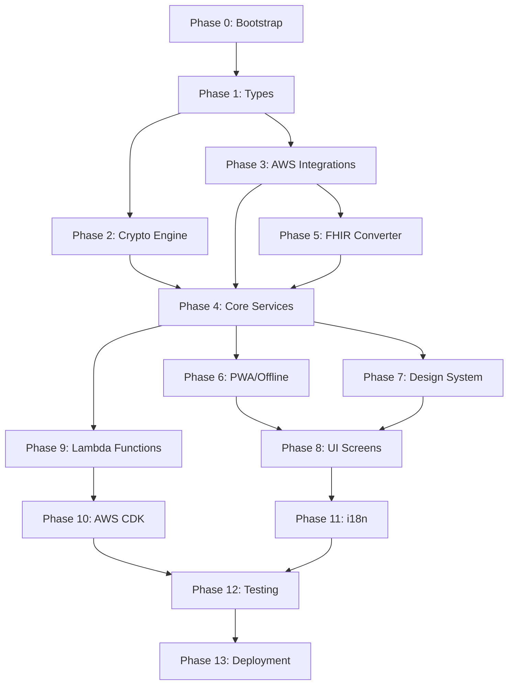

# ArogyaSutra — Agent Implementation Guide

> This document is the master implementation plan for ArogyaSutra. It is divided into phases, ordered by dependency. Each phase lists the exact files to create, the logic to implement, and the validation criteria. Follow phases sequentially — each phase builds on the previous.

---

## Foundational Rules

1. **Read `requirements.md` and `design.md` first** — they are the source of truth for all behavior and interfaces
2. **All encryption/decryption happens client-side** — the server NEVER sees plaintext patient data
3. **Use the exact AWS services specified** — do not substitute with alternatives
4. **FHIR compliance is mandatory** for all structured health data
5. **Test every phase** before moving to the next — use the correctness properties from `design.md`
6. **Card ID format is `AS-XXXX-XXXX`** everywhere — registration, auth, key derivation
7. **Master_Key = PBKDF2(Card_ID || OTP, salt=Card_ID, iterations=100000)** — never stored anywhere

---

## Project Structure

```
ArogyaSutra/
├── public/
│   ├── manifest.json                  # PWA manifest
│   ├── sw.js                          # Service worker
│   ├── icons/                         # App icons (192x192, 512x512)
│   └── favicon.ico
├── src/
│   ├── app/                           # Next.js App Router
│   │   ├── layout.tsx                 # Root layout (PWA meta, fonts)
│   │   ├── page.tsx                   # Welcome/Splash screen
│   │   ├── globals.css                # Global styles
│   │   ├── auth/
│   │   │   └── page.tsx               # Triple-layer auth screen
│   │   ├── dashboard/
│   │   │   └── page.tsx               # Main dashboard after login
│   │   ├── timeline/
│   │   │   ├── page.tsx               # Unified Health Timeline
│   │   │   └── [entryId]/
│   │   │       └── page.tsx           # Timeline entry detail
│   │   ├── scan/
│   │   │   └── page.tsx               # Med-Vision scan + AI preview
│   │   ├── assistant/
│   │   │   └── page.tsx               # RAG Clinical Assistant chat
│   │   ├── emergency/
│   │   │   └── page.tsx               # Break-Glass emergency access
│   │   ├── doctor/
│   │   │   ├── page.tsx               # Doctor portal
│   │   │   ├── register/
│   │   │   │   └── page.tsx           # Doctor MCI registration
│   │   │   └── patient/
│   │   │       └── [patientId]/
│   │   │           └── page.tsx       # Doctor view of patient timeline
│   │   └── settings/
│   │       └── page.tsx               # Patient settings (emergency data, language, biometric)
│   ├── components/
│   │   ├── ui/                        # Reusable UI primitives
│   │   │   ├── Button.tsx
│   │   │   ├── Card.tsx
│   │   │   ├── Input.tsx
│   │   │   ├── Modal.tsx
│   │   │   ├── Badge.tsx              # Status flags (VERIFIED, AI-READ, CRITICAL)
│   │   │   ├── CountdownTimer.tsx     # Break-glass countdown
│   │   │   ├── ConfidenceScore.tsx    # AI extraction confidence display
│   │   │   ├── NetworkStatus.tsx      # Online/offline indicator
│   │   │   └── Spinner.tsx
│   │   ├── auth/
│   │   │   ├── CardIdInput.tsx        # AS-XXXX-XXXX input with mask
│   │   │   ├── DobInput.tsx           # Date of birth picker
│   │   │   ├── OtpInput.tsx           # 6-digit OTP input
│   │   │   └── BiometricPrompt.tsx    # Fingerprint/face unlock
│   │   ├── timeline/
│   │   │   ├── TimelineList.tsx       # Chronological entry list
│   │   │   ├── TimelineEntry.tsx      # Single entry with type tag + status
│   │   │   ├── TimelineFilters.tsx    # Filter bar (type, date, institution)
│   │   │   ├── TimelineSearch.tsx     # Search bar
│   │   │   └── DocumentTypeTag.tsx    # [RX], [Lab], [H] badge
│   │   ├── scan/
│   │   │   ├── CameraCapture.tsx      # Camera integration
│   │   │   ├── ExtractionPreview.tsx  # AI extraction results with confidence
│   │   │   └── ManualEntry.tsx        # Fallback manual data entry form
│   │   ├── assistant/
│   │   │   ├── ChatInterface.tsx      # RAG chat UI
│   │   │   ├── ChatMessage.tsx        # Single message with citations
│   │   │   ├── SourceCitation.tsx     # Linked citation to timeline entry
│   │   │   └── HealthInsight.tsx      # Proactive insight card
│   │   ├── emergency/
│   │   │   ├── BreakGlassButton.tsx   # Emergency access button (splash screen)
│   │   │   ├── MciVerification.tsx    # Medical credential input
│   │   │   ├── CriticalOnlyView.tsx   # Blood group, allergies, meds, conditions
│   │   │   └── EmergencyCountdown.tsx # Timed session countdown
│   │   └── doctor/
│   │       ├── AppendNoteForm.tsx     # Doctor append-only entry form
│   │       ├── ConsentFlow.tsx        # Patient consent request/grant
│   │       └── DoctorBadge.tsx        # Doctor identity + MCI attribution
│   ├── lib/
│   │   ├── crypto/
│   │   │   ├── engine.ts             # CryptographyEngine — Web Crypto API
│   │   │   ├── keyDerivation.ts      # PBKDF2 key derivation (Card ID + OTP)
│   │   │   ├── aesGcm.ts            # AES-256-GCM encrypt/decrypt
│   │   │   ├── rsaOaep.ts           # RSA-OAEP for doctor access keys
│   │   │   └── emergency.ts         # HKDF emergency key derivation
│   │   ├── aws/
│   │   │   ├── cognito.ts           # Amazon Cognito auth (patient + doctor pools)
│   │   │   ├── s3.ts                # Amazon S3 upload/download encrypted blobs
│   │   │   ├── textract.ts          # Amazon Textract OCR calls
│   │   │   ├── comprehend.ts        # Amazon Comprehend Medical entity extraction
│   │   │   ├── bedrock.ts           # Amazon Bedrock RAG queries
│   │   │   ├── healthlake.ts        # AWS HealthLake FHIR operations
│   │   │   ├── sns.ts               # Amazon SNS OTP delivery
│   │   │   ├── dynamodb.ts          # DynamoDB audit logs + metadata
│   │   │   ├── kms.ts               # AWS KMS root key management
│   │   │   └── lambda.ts            # Lambda function invocations
│   │   ├── services/
│   │   │   ├── auth.service.ts      # AuthenticationService implementation
│   │   │   ├── timeline.service.ts  # HealthTimelineService implementation
│   │   │   ├── medvision.service.ts # MedVisionService implementation
│   │   │   ├── access.service.ts    # AccessControlService implementation
│   │   │   ├── rag.service.ts       # RAGAssistant implementation
│   │   │   ├── audit.service.ts     # Audit logging service
│   │   │   └── export.service.ts    # Data export service
│   │   ├── fhir/
│   │   │   ├── converter.ts         # Clinical data → FHIR resource converter
│   │   │   ├── types.ts             # FHIR type definitions
│   │   │   └── validator.ts         # FHIR resource validation
│   │   ├── pwa/
│   │   │   ├── serviceWorker.ts     # Service worker registration
│   │   │   ├── indexedDb.ts         # IndexedDB wrapper for offline cache
│   │   │   ├── syncManager.ts       # Background sync for queued uploads
│   │   │   └── networkStatus.ts     # Online/offline detection
│   │   ├── i18n/
│   │   │   ├── index.ts             # i18n setup
│   │   │   └── locales/
│   │   │       ├── en.json
│   │   │       ├── hi.json
│   │   │       ├── ta.json
│   │   │       ├── te.json
│   │   │       ├── bn.json
│   │   │       ├── mr.json
│   │   │       ├── gu.json
│   │   │       └── kn.json
│   │   ├── hooks/
│   │   │   ├── useAuth.ts           # Authentication state hook
│   │   │   ├── useCrypto.ts         # Encryption/decryption hook
│   │   │   ├── useTimeline.ts       # Timeline data hook
│   │   │   ├── useOffline.ts        # Offline status + sync hook
│   │   │   └── useCountdown.ts      # Break-glass countdown hook
│   │   ├── types/
│   │   │   ├── patient.ts           # Patient, Address, Language types
│   │   │   ├── doctor.ts            # Doctor, MCI credentials types
│   │   │   ├── timeline.ts          # HealthEntry, TimelineEntry, filters
│   │   │   ├── crypto.ts            # EncryptedBlob, keys, access types
│   │   │   ├── emergency.ts         # EmergencyData, BreakGlass types
│   │   │   ├── medvision.ts         # OCR, clinical entities, extraction types
│   │   │   ├── rag.ts               # RAGResponse, citations, insights
│   │   │   └── audit.ts             # Audit log entry types
│   │   └── utils/
│   │       ├── cardId.ts            # AS-XXXX-XXXX generation + validation
│   │       ├── formatters.ts        # Date, currency, medical value formatters
│   │       └── validators.ts        # Input validation utilities
│   └── styles/
│       ├── design-system.css         # Design tokens, colors, typography
│       ├── components.css            # Component-level styles
│       └── animations.css            # Micro-animations, transitions
├── lambda/                            # AWS Lambda functions (serverless backend)
│   ├── auth/
│   │   ├── initiateLogin.ts
│   │   ├── verifyDob.ts
│   │   ├── verifyOtp.ts
│   │   └── sendOtp.ts
│   ├── breakglass/
│   │   ├── initiateBreakGlass.ts
│   │   ├── validateMci.ts
│   │   └── expireSession.ts
│   ├── documents/
│   │   ├── processUpload.ts          # Triggers Textract on S3 upload
│   │   ├── extractEntities.ts        # Comprehend Medical processing
│   │   └── storeInHealthLake.ts      # FHIR conversion + HealthLake storage
│   ├── access/
│   │   ├── grantAccess.ts
│   │   ├── revokeAccess.ts
│   │   └── checkAccess.ts
│   └── audit/
│       └── logAccess.ts
├── tests/
│   ├── unit/
│   │   ├── crypto/
│   │   │   ├── keyDerivation.test.ts
│   │   │   ├── aesGcm.test.ts
│   │   │   └── rsaOaep.test.ts
│   │   ├── services/
│   │   │   ├── auth.test.ts
│   │   │   ├── timeline.test.ts
│   │   │   ├── medvision.test.ts
│   │   │   └── access.test.ts
│   │   └── utils/
│   │       └── cardId.test.ts
│   ├── property/
│   │   ├── crypto.property.test.ts    # Properties 6-10
│   │   ├── auth.property.test.ts      # Properties 11-17
│   │   ├── medvision.property.test.ts # Properties 18-25
│   │   ├── timeline.property.test.ts  # Properties 26-35
│   │   ├── access.property.test.ts    # Properties 36-49
│   │   ├── rag.property.test.ts       # Properties 50-57
│   │   └── pwa.property.test.ts       # Properties 58-65
│   └── e2e/
│       ├── registration.e2e.ts
│       ├── auth.e2e.ts
│       ├── upload.e2e.ts
│       ├── timeline.e2e.ts
│       ├── breakglass.e2e.ts
│       └── doctorAccess.e2e.ts
├── infrastructure/                    # AWS CDK / CloudFormation
│   ├── lib/
│   │   ├── cognito-stack.ts           # Cognito user pools (patient + doctor)
│   │   ├── storage-stack.ts           # S3 buckets + HealthLake
│   │   ├── lambda-stack.ts            # Lambda functions
│   │   ├── dynamodb-stack.ts          # DynamoDB tables
│   │   └── kms-stack.ts               # KMS key configuration
│   └── bin/
│       └── arogyasutra.ts             # CDK app entry point
├── next.config.js                     # Next.js config (PWA plugin)
├── package.json
├── tsconfig.json
├── .env.local                         # AWS credentials (local dev only)
├── .env.example                       # Template for env vars
├── amplify.yml                        # AWS Amplify CI/CD config
├── requirements.md                    # Requirements document
├── design.md                          # Design document
├── agent.md                           # This file
└── README.md
```

---

## Phase 0: Project Bootstrap

**Goal**: Initialize the Next.js PWA project with all tooling.

### Steps

1. **Initialize Next.js project**
   ```bash
   npx -y create-next-app@latest ./ --typescript --tailwind=no --eslint --app --src-dir --import-alias="@/*" --use-npm
   ```

2. **Install core dependencies**
   ```bash
   npm install next-pwa @aws-sdk/client-cognito-identity-provider @aws-sdk/client-s3 @aws-sdk/client-textract @aws-sdk/client-comprehendmedical @aws-sdk/client-bedrock-runtime @aws-sdk/client-dynamodb @aws-sdk/lib-dynamodb @aws-sdk/client-sns @aws-sdk/client-kms aws-amplify idb uuid
   ```

3. **Install dev dependencies**
   ```bash
   npm install -D jest @types/jest ts-jest fast-check @testing-library/react @testing-library/jest-dom playwright @playwright/test aws-sdk-client-mock
   ```

4. **Configure `next.config.js` for PWA**
   - Add `next-pwa` plugin with service worker generation
   - Configure `output: 'standalone'` for Amplify deployment
   - Set up image optimization disabled for static export if needed

5. **Create `public/manifest.json`**
   ```json
   {
     "name": "ArogyaSutra",
     "short_name": "ArogyaSutra",
     "description": "AI-Powered Personal Health Record",
     "start_url": "/",
     "display": "standalone",
     "background_color": "#0A0A0A",
     "theme_color": "#10B981",
     "icons": [
       { "src": "/icons/icon-192.png", "sizes": "192x192", "type": "image/png" },
       { "src": "/icons/icon-512.png", "sizes": "512x512", "type": "image/png" }
     ]
   }
   ```

6. **Create `.env.example`** with all required AWS env vars:
   ```
   NEXT_PUBLIC_AWS_REGION=ap-south-1
   NEXT_PUBLIC_COGNITO_PATIENT_POOL_ID=
   NEXT_PUBLIC_COGNITO_DOCTOR_POOL_ID=
   NEXT_PUBLIC_COGNITO_CLIENT_ID=
   NEXT_PUBLIC_S3_BUCKET=
   NEXT_PUBLIC_HEALTHLAKE_DATASTORE_ID=
   AWS_ACCESS_KEY_ID=
   AWS_SECRET_ACCESS_KEY=
   SNS_TOPIC_ARN=
   KMS_KEY_ID=
   DYNAMODB_AUDIT_TABLE=
   DYNAMODB_ACCESS_TABLE=
   BEDROCK_MODEL_ID=anthropic.claude-3-sonnet
   ```

7. **Set up design system** in `src/styles/design-system.css`:
   - Define CSS custom properties for colors (dark mode first, emerald/teal health theme)
   - Typography scale using Inter from Google Fonts
   - Spacing, border-radius, shadow tokens
   - Glassmorphism utility classes

### Validation
- `npm run dev` starts without errors
- PWA manifest loads at `/manifest.json`
- Service worker registers in browser

---

## Phase 1: Type Definitions

**Goal**: Define all TypeScript interfaces from `design.md` as the shared contract.

### Steps

Create files in `src/lib/types/` matching every interface from the **Data Models** and **Components and Interfaces** sections of `design.md`:

1. **`patient.ts`** — `Patient`, `Address`, `Language`, `EmergencyContact`
2. **`doctor.ts`** — `Doctor`, `MciCredentials`
3. **`crypto.ts`** — `EncryptedBlob`, `EncryptedAccessKey`, `EncryptedEmergencyBlob`, `CryptoKey` wrappers
4. **`timeline.ts`** — `HealthEntry`, `TimelineEntry`, `StoredTimelineEntry`, `TimelineOptions`, `SearchQuery`, `TimelineFilters`, `StatusFlag`, type tags
5. **`emergency.ts`** — `EmergencyData`, `EmergencyAccess`, `GeoLocation`, `EmergencyCredentials`
6. **`medvision.ts`** — `OCRResult`, `TextRegion`, `ClinicalEntities`, `Medication`, `LabResult`, `ExtractionResult`, `FHIRBundle`
7. **`rag.ts`** — `RAGResponse`, `SourceCitation`, `HealthInsight`
8. **`audit.ts`** — `StoredAuditLog`, `AccessLogEntry`, `StoredAccessGrant`
9. **`auth.ts`** — `LoginSession`, `OTPChallenge`, `AuthToken`, `BiometricCredential`, `LockStatus`

### Validation
- `npm run build` succeeds with zero type errors
- All interfaces match `design.md` exactly

---

## Phase 2: Cryptography Engine (Client-Side)

**Goal**: Implement the zero-knowledge encryption core. This is the MOST critical component — everything depends on it.

### Files
- `src/lib/crypto/keyDerivation.ts`
- `src/lib/crypto/aesGcm.ts`
- `src/lib/crypto/rsaOaep.ts`
- `src/lib/crypto/emergency.ts`
- `src/lib/crypto/engine.ts`

### Steps

1. **Key Derivation (`keyDerivation.ts`)**
   - Implement `deriveMasterKey(cardId, otp, salt)` using `window.crypto.subtle.importKey` + `deriveKey` with PBKDF2
   - 100,000 iterations, SHA-256 hash, 256-bit AES-GCM output
   - Salt = Card_ID encoded as UTF-8
   - **The returned CryptoKey must NEVER be serialized, exported, or stored** — it exists only in memory

2. **AES-GCM Encryption (`aesGcm.ts`)**
   - `encrypt(data, masterKey)` → generate random 12-byte IV via `crypto.getRandomValues`, encrypt with `crypto.subtle.encrypt('AES-GCM', key, data)`, return `EncryptedBlob { ciphertext, iv, algorithm: 'AES-GCM', keyId }`
   - `decrypt(blob, masterKey)` → decrypt with same IV from blob

3. **RSA-OAEP (`rsaOaep.ts`)**
   - `generateKeyPair()` → RSA-OAEP 2048-bit for doctor access keys
   - `encryptWithPublicKey(data, publicKey)` → wrap Master_Key for doctor access
   - `decryptWithPrivateKey(encrypted, privateKey)` → unwrap on doctor's device

4. **Emergency Key (`emergency.ts`)**
   - `deriveEmergencyKey(masterKey)` → HKDF with info="emergency"
   - `encryptEmergencyData(data, emergencyKey)` → AES-GCM with derived key
   - `decryptEmergencyData(blob, emergencyKey)` → for Break-Glass access

5. **Engine (`engine.ts`)**
   - Compose all modules into `CryptographyEngine` class implementing the interface from `design.md`
   - Add `reEncryptAll(oldKey, newKey, blobs)` for credential changes

### Validation — Correctness Properties 6-10
```
Property 6: deriveMasterKey(same inputs) → same key every time
Property 7: encrypt(data, key) then decrypt(result, key) === data
Property 8: encrypted data on "server" is not readable without key
Property 9: no key material persisted to any storage
Property 10: re-encryption produces accessible data with new key
```

Run: `npx jest tests/unit/crypto/ && npx jest tests/property/crypto.property.test.ts`

---

## Phase 3: AWS Service Integrations

**Goal**: Wire up all AWS SDK clients as thin wrapper modules.

### Files
- `src/lib/aws/cognito.ts` — `initPatientLogin`, `verifyOtp`, `createUser`, `verifyMci`
- `src/lib/aws/s3.ts` — `uploadEncryptedBlob`, `downloadEncryptedBlob`, `deleteBlob`
- `src/lib/aws/textract.ts` — `analyzeDocument(imageBuffer)` → `OCRResult`
- `src/lib/aws/comprehend.ts` — `detectEntities(text)` → `ClinicalEntities`
- `src/lib/aws/bedrock.ts` — `invokeModel(prompt, context)` → RAG response
- `src/lib/aws/healthlake.ts` — `createFhirResource`, `searchFhir`, `getFhirResource`
- `src/lib/aws/sns.ts` — `sendOtp(phoneNumber, otp)`, `sendNotification(phone, message)`
- `src/lib/aws/dynamodb.ts` — `putAuditLog`, `queryAuditLogs`, `putAccessGrant`, `getAccessGrant`
- `src/lib/aws/kms.ts` — `generateDataKey`, `encryptWithKms`, `decryptWithKms`
- `src/lib/aws/lambda.ts` — `invokeLambda(functionName, payload)`

### Steps

1. Each file creates a singleton SDK client configured from env vars (`NEXT_PUBLIC_AWS_REGION`)
2. Each file exports typed functions matching the interfaces in `design.md`
3. All functions handle errors and return typed results or throw typed errors
4. **S3 operations always deal with `EncryptedBlob`** — never plaintext
5. **Textract**: Use `AnalyzeDocument` API for mixed print/handwriting
6. **Comprehend Medical**: Use `DetectEntitiesV2` for medication, dosage, condition extraction
7. **Bedrock**: Use `InvokeModel` with Claude Sonnet; prompt includes patient context from HealthLake

### Validation
- Unit tests with `aws-sdk-client-mock` for each module
- Integration smoke test with real AWS (manual, needs credentials)

---

## Phase 4: Core Services

**Goal**: Implement the six service classes from `design.md`, composing crypto + AWS modules.

### Files & Order (dependency-first)

1. **`audit.service.ts`** — No dependencies. Wraps DynamoDB audit log operations.
   - `logAccess(entry: AccessLogEntry)` → writes to DynamoDB
   - `getAccessLog(patientId)` → returns chronological list
   - All logs are immutable (no update/delete methods)

2. **`auth.service.ts`** — Depends on: cognito, sns, audit
   - Implements `AuthenticationService` interface from `design.md`
   - Triple-layer flow: `initiateLogin` → `verifyDateOfBirth` → `sendOTP` (SNS) → `verifyOTP` (Cognito)
   - Account lock after 3 failures
   - Optional biometric: stores device credential reference, not Master_Key

3. **`medvision.service.ts`** — Depends on: textract, comprehend, s3, fhir converter
   - Implements `MedVisionService` interface
   - Two paths: cloud (Textract) and on-device (PaddleOCR)
   - Pipes text through Comprehend Medical → FHIR converter
   - Returns `ExtractionResult` with confidence score
   - Flags `requiresReview = true` when confidence < 70%

4. **`timeline.service.ts`** — Depends on: s3, healthlake, crypto, medvision, audit
   - Implements `HealthTimelineService` interface
   - Stores encrypted blobs in S3, FHIR resources in HealthLake
   - Search/filter operates on HealthLake FHIR queries
   - Assigns document type tags and status flags per entry

5. **`access.service.ts`** — Depends on: cognito, dynamodb, crypto, audit, sns
   - Implements `AccessControlService` interface
   - Doctor consent flow: patient grants → RSA-OAEP re-encrypted key → stored in DynamoDB
   - Break-Glass: validates MCI via Cognito → captures geolocation → starts countdown timer → returns `EmergencyAccess` → logs to DynamoDB → notifies patient via SNS
   - Revocation immediately deletes access key from DynamoDB

6. **`rag.service.ts`** — Depends on: bedrock, comprehend, healthlake, access
   - Implements `RAGAssistant` interface
   - Query pipeline: Comprehend Medical entity extraction → HealthLake FHIR search → Bedrock prompt with context → response with citations
   - `generateInsights` analyzes trends across timeline (BP, HbA1c, etc.)
   - Respects access control (only searches authorized data)

7. **`export.service.ts`** — Depends on: timeline, crypto, s3
   - Generates PDF + JSON (FHIR) exports
   - Decrypts client-side before export
   - Creates time-limited download links

### Validation — Correctness Properties 11-57
- Run property tests for auth (11-17), medvision (18-25), timeline (26-35), access (36-49), RAG (50-57)

---

## Phase 5: FHIR Converter

**Goal**: Convert Comprehend Medical output → FHIR resources for HealthLake.

### Files
- `src/lib/fhir/types.ts`
- `src/lib/fhir/converter.ts`
- `src/lib/fhir/validator.ts`

### Steps

1. Map `ClinicalEntities` to FHIR resources:
   - `Medication` → FHIR `MedicationStatement`
   - `Diagnosis` → FHIR `Condition`
   - `LabResult` → FHIR `Observation`
   - `VitalSign` → FHIR `Observation` (vital-signs category)
   - `Procedure` → FHIR `Procedure`
   - Document photo → FHIR `DocumentReference`
2. Bundle resources into FHIR `Bundle` with type `collection`
3. Validator checks required fields, valid codes, reference integrity

---

## Phase 6: PWA & Offline Engine

**Goal**: Service worker, IndexedDB cache, background sync, installability.

### Files
- `public/sw.js` (or generated by next-pwa)
- `src/lib/pwa/serviceWorker.ts`
- `src/lib/pwa/indexedDb.ts`
- `src/lib/pwa/syncManager.ts`
- `src/lib/pwa/networkStatus.ts`

### Steps

1. **Service Worker**: Cache app shell (all Next.js static assets) on install. Use stale-while-revalidate for API responses.
2. **IndexedDB** (`idb` library): Store decrypted timeline entries locally. Schema: `timeline-cache` store keyed by `entryId`.
3. **Sync Manager**: Queue failed uploads as `PendingUpload` in IndexedDB `upload-queue` store. Register for Background Sync API. On sync event, retry all queued uploads to S3.
4. **Network Status**: Listen to `online`/`offline` events. Expose `useOffline` hook.

### Validation — Properties 58-65
- PWA Lighthouse audit score ≥ 90
- Offline mode: view cached timeline, queue new photo, sync when online
- Install prompt appears on Android Chrome

---

## Phase 7: UI — Design System & Primitives

**Goal**: Build the visual foundation. ArogyaSutra must look premium, not like a prototype.

### Design Direction
- **Dark mode primary** with emerald/teal health accent (#10B981)
- Glassmorphism cards with subtle backdrop-filter blur
- Inter font (Google Fonts)
- Smooth transitions on all state changes (150-300ms ease)
- Micro-animations: skeleton loaders, fade-in entries, pulse on critical badges

### Steps

1. **`design-system.css`**: CSS custom properties for all tokens
2. **`animations.css`**: Keyframes for fade-in, slide-up, pulse, countdown
3. **UI Primitives** (`src/components/ui/`):
   - `Button` — primary (emerald), secondary, danger, ghost variants
   - `Card` — glassmorphic container with optional glow border
   - `Input` — with label, error state, validation
   - `Modal` — centered overlay with backdrop blur
   - `Badge` — for [RX], [Lab], [H], VERIFIED, AI-READ, CRITICAL
   - `CountdownTimer` — animated circular countdown (break-glass)
   - `ConfidenceScore` — percentage bar with color coding (green/yellow/red)
   - `NetworkStatus` — floating pill showing online/offline
   - `Spinner` — loading state

---

## Phase 8: UI — Application Screens

**Goal**: Build all screens from Requirement 16, connecting to services.

### Screen Build Order

1. **Welcome / Splash** (`app/page.tsx`)
   - ArogyaSutra logo + tagline
   - "Enter Health Vault" primary CTA → navigates to `/auth`
   - **Emergency Break-Glass button** prominently visible (red, pulsing) → navigates to `/emergency`
   - Language selector dropdown

2. **Triple-Layer Auth** (`app/auth/page.tsx`)
   - Step 1: Card ID input (masked `AS-____-____`)
   - Step 2: DOB picker
   - Step 3: OTP input (6 digits) + "Resend OTP" button
   - Progress indicator showing current step
   - On success → derive Master_Key → navigate to `/dashboard`
   - After initial login, offer biometric enrollment

3. **Dashboard** (`app/dashboard/page.tsx`)
   - Quick stats: total records, last upload, health score
   - "Scan Document" CTA → `/scan`
   - "View Timeline" → `/timeline`
   - "AI Assistant" → `/assistant`
   - "Settings" → `/settings`
   - Recent timeline entries (last 5)
   - Proactive health insights from RAG

4. **Med-Vision Scan** (`app/scan/page.tsx`)
   - Camera capture component with viewfinder
   - "Upload from gallery" alternative
   - On capture → show AI Extraction Preview:
     - Confidence score bar
     - Extracted fields (doctor name, medications, dosages, lab values) in editable form
     - "Confirm & Save" / "Edit" / "Manual Entry" buttons
   - On confirm → encrypt → upload to S3 → trigger Textract pipeline

5. **Unified Health Timeline** (`app/timeline/page.tsx`)
   - Filter bar: entry type checkboxes, date range picker, institution dropdown
   - Search bar: medication, diagnosis, doctor, institution
   - Scrollable chronological list (newest first), grouped by date
   - Each entry shows: type tag ([RX]/[Lab]/[H]), date, title, source institution, status flags
   - Click entry → `/timeline/[entryId]` detail view with full data + original photo

6. **AI Clinical Assistant** (`app/assistant/page.tsx`)
   - Chat interface with message bubbles
   - User input at bottom with send button
   - Bot responses include inline source citations (clickable → timeline entry)
   - Proactive health insight cards at top of chat
   - Example prompts: "Show me last 3 sugar readings", "Any drug interactions?"

7. **Break-Glass Emergency** (`app/emergency/page.tsx`)
   - MCI credential input form (Registration number, name, institution)
   - Patient ID input (whose data to access)
   - Geolocation capture (browser Geolocation API — mandatory, block if denied)
   - On verification success → Critical-Only View:
     - Blood Group, Allergies, Critical Medications, Active Conditions
     - **Countdown timer** (large, visible, e.g., 5 minutes)
     - Auto-logout on expiry
   - All rendered in high-contrast emergency red theme

8. **Doctor Portal** (`app/doctor/page.tsx`)
   - Doctor login (MCI + Cognito doctor pool)
   - List of patients who have granted access
   - Patient view: full timeline (read-only) + append note form
   - Append form: note type, text, optional document upload
   - All additions attributed: "Dr. [Name] (MCI: [Number]) added on [date]"

9. **Settings** (`app/settings/page.tsx`)
   - Emergency Data config: blood group, allergies, critical meds, conditions, emergency contacts
   - Language preference selector
   - Biometric unlock toggle
   - Active doctor access grants (with revoke buttons)
   - Audit log viewer
   - Data export (PDF / JSON FHIR)
   - Account deletion

---

## Phase 9: Lambda Functions (Serverless Backend)

**Goal**: Deploy AWS Lambda functions for server-side processing.

### Functions

1. **Auth Lambdas** (`lambda/auth/`):
   - `initiateLogin` — validate Card ID exists in Cognito
   - `verifyDob` — check DOB against Cognito user attributes
   - `sendOtp` — generate OTP, send via SNS
   - `verifyOtp` — validate OTP, return Cognito tokens

2. **Break-Glass Lambdas** (`lambda/breakglass/`):
   - `initiateBreakGlass` — validate MCI, create timed session, log to DynamoDB, notify patient
   - `validateMci` — check MCI registration against council database
   - `expireSession` — scheduled Lambda to clean expired sessions

3. **Document Lambdas** (`lambda/documents/`):
   - `processUpload` — triggered by S3 put event, calls Textract
   - `extractEntities` — takes Textract output, runs Comprehend Medical
   - `storeInHealthLake` — converts to FHIR, stores in HealthLake

4. **Access Lambdas** (`lambda/access/`):
   - `grantAccess` — create access grant in DynamoDB
   - `revokeAccess` — delete access key, update DynamoDB
   - `checkAccess` — verify doctor has active, non-expired grant

5. **Audit Lambda** (`lambda/audit/`):
   - `logAccess` — append-only write to DynamoDB audit table

---

## Phase 10: AWS Infrastructure (CDK)

**Goal**: Define all AWS resources as Infrastructure as Code.

### Stacks

1. **Cognito Stack**: Patient user pool + Doctor user pool + app clients
2. **Storage Stack**: S3 bucket (server-side encryption) + HealthLake datastore
3. **Lambda Stack**: All Lambda functions with IAM roles + S3 event triggers
4. **DynamoDB Stack**: `audit-logs` table + `access-grants` table + `sessions` table
5. **KMS Stack**: Customer-managed key for root encryption

### Deploy
```bash
cd infrastructure
npx cdk deploy --all
```

---

## Phase 11: i18n (Multi-Language)

**Goal**: Support 8 Indian languages.

### Steps
1. Create locale JSON files for: English, Hindi, Tamil, Telugu, Bengali, Marathi, Gujarati, Kannada
2. All UI strings go through `t('key')` function — no hardcoded text
3. Language selector on welcome screen and settings
4. Store preference in patient profile

---

## Phase 12: Testing

**Goal**: Achieve comprehensive test coverage.

### Test Execution Order

1. **Unit tests** (Phase 2-6 outputs):
   ```bash
   npx jest tests/unit/
   ```

2. **Property tests** (95 properties from `design.md`):
   ```bash
   npx jest tests/property/
   ```

3. **E2E tests** (full user flows):
   ```bash
   npx playwright test tests/e2e/
   ```

### Key E2E Flows to Test
- Patient registration → card ID generation → first login
- Document upload → Textract → extraction preview → save to timeline
- Timeline view → filter → search → entry detail
- Doctor access grant → doctor views timeline → appends note
- Break-Glass → MCI verification → critical-only view → countdown → auto-expiry
- Offline → view cached timeline → queue upload → come online → auto-sync

---

## Phase 13: Deployment

**Goal**: Ship to production via AWS Amplify.

### Steps

1. **Create `amplify.yml`**:
   ```yaml
   version: 1
   frontend:
     phases:
       preBuild:
         commands:
           - npm ci
       build:
         commands:
           - npm run build
     artifacts:
       baseDirectory: .next
       files:
         - '**/*'
     cache:
       paths:
         - node_modules/**/*
   ```

2. Connect GitHub repo to Amplify Console
3. Configure environment variables from `.env.example`
4. Set custom domain + SSL
5. Deploy CDK infrastructure stacks
6. Run E2E tests against staging
7. Promote to production

---

## Dependency Graph



---

## Critical Implementation Notes

> [!CAUTION]
> **Zero-Knowledge is non-negotiable.** If at ANY point during implementation you find that plaintext patient data reaches the server, STOP and fix the architecture. The Master_Key must NEVER be stored, transmitted, or logged.

> [!IMPORTANT]
> **Break-Glass countdown must auto-expire.** Use both client-side timer AND server-side Lambda scheduled expiry. The session must die even if the browser is closed.

> [!WARNING]
> **Doctor append-only is enforced server-side.** Do not rely on client-side checks alone. Lambda functions for doctor writes must verify `addedByType === 'DOCTOR'` and reject any PUT/DELETE operations on existing entries.

> [!TIP]
> **PaddleOCR is optional for MVP.** Start with Amazon Textract (cloud OCR) only. Add PaddleOCR on-device processing as a Phase 2 enhancement after core flows work.
