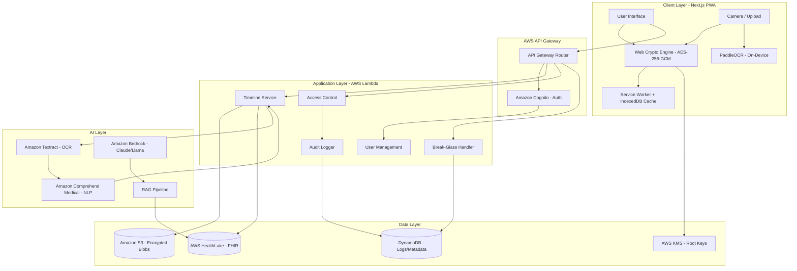

# Design Document: ArogyaSutra

## Overview

ArogyaSutra is a Zero-Knowledge encrypted Personal Health Record system that combines physical security (ArogyaSutra Cards with unique IDs in `AS-XXXX-XXXX` format) with client-side AES-256 encryption to give patients complete sovereignty over their medical data. The system uses AI (Amazon Textract, Comprehend Medical, Bedrock) to digitize paper medical documents, maintains a chronological FHIR-compliant health timeline, and provides timed emergency access protocols — all while ensuring the platform operator cannot access plaintext patient data.

The architecture follows a client-heavy model where all encryption/decryption happens in the browser using Web Crypto API. The backend (AWS Lambda, S3, HealthLake, DynamoDB) serves as an encrypted data store with no access to decryption keys. AI processing for document digitization happens via Amazon Textract and Comprehend Medical, with structured results stored in FHIR format in AWS HealthLake.

## Architecture

### High-Level Architecture



### Security Architecture

The system implements a Zero-Knowledge architecture where:

1. **Client-Side Encryption**: All patient data is encrypted in the browser using Web Crypto API (AES-256-GCM) before transmission
2. **Key Derivation**: Master keys are derived from Card ID + OTP using PBKDF2 (100,000 iterations) and never leave the client — never stored anywhere
3. **Encrypted Storage**: Amazon S3 stores only encrypted blobs; AWS HealthLake stores encrypted FHIR records; the server has no access to plaintext
4. **Selective Decryption**: Emergency data uses a separate encryption scheme allowing timed Break-Glass access
5. **AWS KMS Integration**: Root key management via KMS, but with client-side encryption ensuring plaintext never reaches AWS

### System Flow (Step by Step)

```
1. Patient opens the Next.js PWA → Web Crypto API initializes
2. Patient enters Card ID + DOB + OTP → decryption key derived locally via PBKDF2
3. Encrypted health blob fetched from Amazon S3
4. Decrypted on device — server never sees plaintext
5. Patient scans a prescription → image uploaded (still encrypted) to S3
6. Upload triggers Amazon Textract → extracts raw text
7. Text passed to Amazon Comprehend Medical → structured medical entities extracted
8. Structured data stored in AWS HealthLake in FHIR format
9. For RAG queries → Bedrock retrieves context from HealthLake and generates response
10. For emergencies → Lambda handles Break-Glass bypass, logs to DynamoDB
```

### Data Flow Diagrams

1. **Document Upload Flow**:
   - Patient captures photo → PaddleOCR (on-device, optional) or client encrypts with Master_Key → Upload encrypted blob to S3 → S3 triggers Lambda → Amazon Textract extracts text → Amazon Comprehend Medical extracts medical entities → Structured FHIR data encrypted → Stored in HealthLake + S3

2. **Timeline Retrieval Flow**:
   - Patient authenticates via Cognito (Card ID + DOB + OTP) → Master_Key derived locally → Server sends encrypted timeline from HealthLake/S3 → Client decrypts with Master_Key → Display plaintext in PWA

3. **Doctor Access Flow**:
   - Patient grants access via consent flow → System creates access token with re-encrypted data key via RSA-OAEP → Doctor retrieves encrypted data → Doctor's client decrypts with access token → Display plaintext → All actions logged to DynamoDB

4. **Emergency Access Flow**:
   - Emergency personnel authenticates → Cognito validates MCI credentials → Lambda captures geolocation → Decrypts emergency data using break-glass key → Returns Critical-Only view → Starts countdown timer → Logs to DynamoDB → Notifies patient via SNS → Auto-expires session

## Components and Interfaces

### 1. Authentication Service (Amazon Cognito)

**Responsibility**: Manages triple-layer authentication, separate patient/doctor user pools, and session management.

**Interface**:
```typescript
interface AuthenticationService {
  // Initiate login with Patient ID (Layer 1)
  initiateLogin(patientId: string): Promise<LoginSession>

  // Verify date of birth (Layer 2)
  verifyDateOfBirth(sessionId: string, dob: Date): Promise<OTPChallenge>

  // Send OTP to registered mobile via Amazon SNS + Twilio (Layer 3)
  sendOTP(sessionId: string): Promise<void>

  // Verify OTP (Layer 3)
  verifyOTP(sessionId: string, otp: string): Promise<AuthToken>

  // Validate existing auth token
  validateToken(token: string): Promise<TokenValidation>

  // Handle failed login attempts
  recordFailedAttempt(patientId: string): Promise<LockStatus>

  // Enable biometric unlock for returning users
  enableBiometricUnlock(patientId: string, deviceId: string): Promise<void>

  // Authenticate via biometric (returning users only)
  biometricLogin(patientId: string, deviceId: string, credential: BiometricCredential): Promise<AuthToken>
}

interface LoginSession {
  sessionId: string
  patientId: string
  expiresAt: Date
  stage: 'PATIENT_ID' | 'DOB' | 'OTP'
}

interface OTPChallenge {
  sessionId: string
  maskedPhone: string // e.g., "****1234"
  expiresAt: Date
}

interface AuthToken {
  token: string
  patientId: string
  expiresAt: Date
  permissions: string[]
  cognitoSession: string
}

interface BiometricCredential {
  type: 'FINGERPRINT' | 'FACE'
  assertion: ArrayBuffer
}
```

**Key Design Decisions**:
- OTP expires in 5 minutes to balance security and usability
- OTP delivered via Amazon SNS + Twilio for reliable SMS delivery in India
- Three failed attempts trigger 30-minute account lock
- Session state managed via Amazon Cognito user pools (separate pools for patients and doctors)
- Tokens are JWT with short expiry (1 hour) requiring refresh
- Optional biometric unlock stores encrypted device credential, not the Master_Key

### 2. Cryptography Engine (Client-Side)

**Responsibility**: Handles all encryption/decryption operations in the browser using Web Crypto API. The key is derived ephemerally from Card ID + OTP and is never stored.

**Interface**:
```typescript
interface CryptographyEngine {
  // Derive master key from patient credentials — key is NEVER stored
  deriveMasterKey(cardId: string, otp: string, salt: string): Promise<CryptoKey>

  // Encrypt health data before upload to S3
  encryptData(data: HealthData, masterKey: CryptoKey): Promise<EncryptedBlob>

  // Decrypt health data after retrieval from S3
  decryptData(encrypted: EncryptedBlob, masterKey: CryptoKey): Promise<HealthData>

  // Encrypt document photo before upload
  encryptDocument(imageBlob: Blob, masterKey: CryptoKey): Promise<EncryptedBlob>

  // Re-encrypt data for doctor access using RSA-OAEP
  createAccessKey(masterKey: CryptoKey, doctorPublicKey: CryptoKey): Promise<EncryptedAccessKey>

  // Encrypt emergency data with break-glass key
  encryptEmergencyData(data: EmergencyData, masterKey: CryptoKey): Promise<EncryptedEmergencyBlob>

  // Re-encrypt all data when credentials change
  reEncryptAll(oldKey: CryptoKey, newKey: CryptoKey, blobs: EncryptedBlob[]): Promise<EncryptedBlob[]>
}

interface EncryptedBlob {
  ciphertext: ArrayBuffer
  iv: ArrayBuffer        // Initialization Vector — unique per encryption
  algorithm: 'AES-GCM'
  keyId: string          // Reference to AWS KMS root key
}

interface EncryptedAccessKey {
  encryptedKey: ArrayBuffer
  doctorId: string
  expiresAt: Date
}
```

**Key Design Decisions**:
- Use AES-GCM 256-bit for symmetric encryption (fast, authenticated)
- Use PBKDF2 with 100,000 iterations for key derivation (resistant to brute force)
- Key derived from Card ID + OTP — never stored on server, browser, or anywhere
- Use RSA-OAEP for asymmetric encryption (doctor access keys)
- Store IV (initialization vector) with each encrypted blob — unique per encryption
- Emergency data uses dual encryption: patient key + break-glass key
- AWS KMS manages root keys but plaintext never reaches AWS

**Encryption Scheme**:
```
Master_Key = PBKDF2(Card_ID || OTP, salt=Card_ID, iterations=100000)
Encrypted_Data = AES-GCM-256(plaintext, key=Master_Key, iv=random())
Emergency_Key = HKDF(Master_Key, info="emergency")
Encrypted_Emergency = AES-GCM-256(emergency_data, key=Emergency_Key, iv=random())
Doctor_Access_Key = RSA-OAEP(Master_Key, publicKey=Doctor_PublicKey)
```

### 3. Med-Vision Service (AI Document Digitization)

**Responsibility**: Extracts structured clinical data from photos of medical documents using Amazon Textract (cloud OCR), PaddleOCR (on-device), and Amazon Comprehend Medical (medical NLP).

**Interface**:
```typescript
interface MedVisionService {
  // Process uploaded document photo (cloud path via Textract)
  processDocument(encryptedImage: EncryptedBlob, patientId: string): Promise<ExtractionResult>

  // Process document on-device (PaddleOCR — privacy-first, no upload)
  processDocumentOnDevice(imageBlob: Blob): Promise<ExtractionResult>

  // Extract text using Amazon Textract (cloud OCR)
  performCloudOCR(imageBuffer: ArrayBuffer): Promise<OCRResult>

  // Extract text using PaddleOCR (on-device OCR)
  performLocalOCR(imageBlob: Blob): Promise<OCRResult>

  // Extract clinical entities using Amazon Comprehend Medical
  extractClinicalData(text: string): Promise<ClinicalEntities>

  // Convert structured data to FHIR format for HealthLake
  convertToFHIR(entities: ClinicalEntities): Promise<FHIRBundle>

  // Validate and structure extracted data
  structureData(entities: ClinicalEntities): Promise<StructuredHealthData>
}

interface OCRResult {
  text: string
  confidence: number
  language: string
  regions: TextRegion[]
  source: 'TEXTRACT' | 'PADDLEOCR'
}

interface TextRegion {
  text: string
  boundingBox: BoundingBox
  confidence: number
}

interface ClinicalEntities {
  doctorName: string
  medications: Medication[]
  diagnoses: Diagnosis[]
  labResults: LabResult[]
  vitals: VitalSign[]
  procedures: Procedure[]
  followUpInstructions: string[]
  confidence: number
}

interface Medication {
  name: string
  dosage: string
  frequency: string
  duration: string
  confidence: number
}

interface LabResult {
  testName: string
  value: string
  unit: string
  referenceRange: string
  confidence: number
  isCritical: boolean
}

interface ExtractionResult {
  success: boolean
  structuredData: StructuredHealthData
  fhirBundle: FHIRBundle
  originalText: string
  confidence: number
  requiresReview: boolean  // True when confidence < 70%
  errors: string[]
  source: 'TEXTRACT' | 'PADDLEOCR'
}

interface FHIRBundle {
  resourceType: 'Bundle'
  type: 'collection'
  entry: FHIRResource[]
}
```

**Key Design Decisions**:
- **Amazon Textract** for cloud OCR — superior handwriting recognition for medical documents
- **PaddleOCR** for on-device OCR — privacy-first option where image never leaves the device
- **Amazon Comprehend Medical** for medical NLP entity extraction (replaces generic NLP models)
- All extracted data converted to **FHIR format** before storage in AWS HealthLake
- Confidence threshold of 70% for auto-acceptance; below 70% flagged for manual review
- "AI Extraction Preview" shown to patient with confidence score before saving
- Preserve original document photo (encrypted in S3) alongside extracted data
- Support handwritten text recognition with lower confidence expectations

**Processing Pipeline**:
```
Photo Upload → [On-Device: PaddleOCR] OR [Cloud: Amazon Textract] →
Text Extraction → Language Detection →
Amazon Comprehend Medical → Entity Recognition →
Confidence Scoring → AI Extraction Preview (patient confirms/corrects) →
FHIR Conversion → Encryption → Storage (S3 + HealthLake)
```

### 4. Health Timeline Service

**Responsibility**: Manages the chronological health record with document type tags, source institution tracking, status flags, and FHIR-compliant storage in AWS HealthLake.

**Interface**:
```typescript
interface HealthTimelineService {
  // Add new entry to timeline
  addEntry(patientId: string, entry: HealthEntry): Promise<TimelineEntry>

  // Retrieve complete timeline
  getTimeline(patientId: string, options: TimelineOptions): Promise<Timeline>

  // Search timeline
  searchTimeline(patientId: string, query: SearchQuery): Promise<TimelineEntry[]>

  // Filter timeline by criteria
  filterTimeline(patientId: string, filters: TimelineFilters): Promise<TimelineEntry[]>

  // Get specific entry details
  getEntry(patientId: string, entryId: string): Promise<TimelineEntry>

  // Update entry (patient only)
  updateEntry(patientId: string, entryId: string, updates: Partial<HealthEntry>): Promise<TimelineEntry>

  // Store structured data in HealthLake as FHIR resources
  storeInHealthLake(patientId: string, fhirBundle: FHIRBundle): Promise<void>
}

interface HealthEntry {
  type: 'PRESCRIPTION' | 'LAB_REPORT' | 'DISCHARGE_SUMMARY' | 'CONSULTATION' | 'VACCINATION' | 'IMAGING'
  typeTag: '[RX]' | '[Lab]' | '[H]' | '[C]' | '[V]' | '[I]'
  date: Date
  clinicalData: ClinicalEntities
  documents: string[]           // Document IDs in S3
  addedBy: string               // Patient ID or Doctor ID
  addedByType: 'PATIENT' | 'DOCTOR'
  sourceInstitution?: string    // e.g., "Apollo Hospitals", "Metropolis Labs"
  statusFlags: StatusFlag[]
  notes: string
}

type StatusFlag = 'VERIFIED' | 'AI-READ' | 'CRITICAL'

interface TimelineEntry {
  id: string
  patientId: string
  entry: HealthEntry
  createdAt: Date
  updatedAt: Date
  encryptedData: EncryptedBlob
  fhirResourceId: string // Reference to HealthLake FHIR resource
}

interface TimelineOptions {
  startDate?: Date
  endDate?: Date
  limit?: number
  offset?: number
  sortOrder: 'ASC' | 'DESC'
}

interface SearchQuery {
  text: string
  fields: ('medications' | 'diagnoses' | 'doctors' | 'notes' | 'institutions')[]
}

interface TimelineFilters {
  entryTypes?: HealthEntry['type'][]
  statusFlags?: StatusFlag[]
  dateRange?: { start: Date, end: Date }
  addedBy?: string
  sourceInstitution?: string
}
```

**Key Design Decisions**:
- Document type tags: [RX] prescriptions, [Lab] lab reports, [H] hospitalization, [C] consultation, [V] vaccination, [I] imaging
- Status flags: VERIFIED (doctor-confirmed), AI-READ (AI-extracted), CRITICAL (flagged urgent)
- Source institution tracked per entry for multi-hospital patients
- Structured FHIR data stored in AWS HealthLake for interoperability
- Encrypted blobs stored in Amazon S3 alongside FHIR references
- Default sort: newest first; pagination for large timelines
- Immutable entries (updates create new versions, append-only for doctors)
- Same-date entries grouped in UI display

### 5. Access Control Service

**Responsibility**: Manages patient-doctor access permissions, patient consent flow, and Break-Glass emergency access with timed sessions and countdown.

**Interface**:
```typescript
interface AccessControlService {
  // Grant doctor access to patient records (with consent flow)
  grantDoctorAccess(patientId: string, doctorId: string, permissions: AccessPermissions): Promise<AccessGrant>

  // Revoke doctor access
  revokeDoctorAccess(patientId: string, doctorId: string): Promise<void>

  // Check if doctor has access
  checkAccess(doctorId: string, patientId: string): Promise<AccessStatus>

  // Initiate break-glass emergency access with timed countdown
  initiateBreakGlass(emergencyPersonnelId: string, patientId: string, mciRegistration: string, location: GeoLocation): Promise<EmergencyAccess>

  // Validate emergency personnel MCI credentials via Cognito
  validateEmergencyCredentials(credentials: EmergencyCredentials): Promise<boolean>

  // Get access audit log from DynamoDB
  getAccessLog(patientId: string): Promise<AccessLogEntry[]>
}

interface AccessPermissions {
  canView: boolean
  canAppend: boolean    // Append-only mode for doctors
  canModify: boolean    // Always false for doctors by default
  expiresAt?: Date
}

interface AccessGrant {
  grantId: string
  patientId: string
  doctorId: string
  doctorMCI: string     // MCI Registration number
  permissions: AccessPermissions
  accessKey: EncryptedAccessKey
  grantedAt: Date
}

interface EmergencyAccess {
  accessId: string
  patientId: string
  emergencyPersonnelId: string
  mciRegistration: string
  emergencyData: EmergencyData  // Critical-Only view
  location: GeoLocation
  accessedAt: Date
  expiresAt: Date               // Short-lived (minutes, not hours)
  countdownSeconds: number      // Visible countdown timer
  sessionActive: boolean
}

interface EmergencyData {
  bloodGroup: string
  allergies: string[]
  chronicConditions: string[]
  criticalMedications: string[]
  emergencyContacts: EmergencyContact[]
}

interface GeoLocation {
  latitude: number
  longitude: number
  accuracy: number
  timestamp: Date
}

interface AccessLogEntry {
  timestamp: Date
  accessorId: string
  accessorType: 'PATIENT' | 'DOCTOR' | 'EMERGENCY'
  accessorMCI?: string
  action: 'VIEW' | 'APPEND' | 'MODIFY' | 'BREAK_GLASS'
  location?: GeoLocation
  ipAddress: string
  sessionDuration?: number // For break-glass: seconds active
}

interface EmergencyCredentials {
  mciRegistration: string   // e.g., "KA-28411"
  name: string
  institution: string
}
```

**Key Design Decisions**:
- Default doctor access is append-only (cannot modify/delete patient history)
- Patient consent flow required before granting doctor access
- All doctor additions logged and attributed (e.g., "Dr. Gupta added a note")
- **Break-Glass access limited to Critical-Only view**: Blood Group, Allergies, Critical Medications, Active Conditions
- **Break-Glass uses timed countdown** (minutes, not hours) with visible timer and auto-expiry
- All access logged to DynamoDB with timestamp, identity, MCI registration, and geolocation
- Emergency personnel must have verified MCI credentials (validated via Cognito)
- Patient AND emergency contact notified of Break-Glass access via Amazon SNS
- AWS Lambda handles the Break-Glass bypass logic

### 6. RAG Clinical Assistant (Amazon Bedrock)

**Responsibility**: Provides natural language query interface for doctors and patients, powered by Amazon Bedrock (Claude/Llama), with source citations and proactive health insights.

**Interface**:
```typescript
interface RAGAssistant {
  // Process natural language query via Bedrock
  query(userId: string, patientId: string, question: string): Promise<RAGResponse>

  // Generate proactive health insights from timeline data
  generateInsights(patientId: string, timeline: Timeline): Promise<HealthInsight[]>

  // Index patient timeline for RAG retrieval from HealthLake
  indexTimeline(patientId: string, timeline: Timeline): Promise<void>

  // Update index when new entries added
  updateIndex(patientId: string, newEntries: TimelineEntry[]): Promise<void>
}

interface RAGResponse {
  answer: string
  sources: SourceCitation[]
  confidence: number
  clarificationNeeded: boolean
  clarificationQuestions: string[]
}

interface SourceCitation {
  entryId: string
  entryDate: Date
  entryType: string
  relevantExcerpt: string
  confidence: number
}

interface HealthInsight {
  type: 'TREND' | 'ALERT' | 'IMPROVEMENT'
  description: string // e.g., "Systolic BP rising over 6 months (avg 145 mmHg)"
  metric: string
  timeRange: { start: Date, end: Date }
  sources: SourceCitation[]
}
```

**Key Design Decisions**:
- Use **Amazon Bedrock** with Claude or Llama models for answer generation (replaces generic GPT-4 / OpenAI)
- Use **Amazon Comprehend Medical** for entity extraction before querying Bedrock
- Retrieve context from **AWS HealthLake** (FHIR-compliant queries)
- Always cite source documents with entry IDs and direct links
- **Proactive health insights**: trend detection (e.g., "HbA1c dropped 8.1% → 7.4% since Aug 2025"), alert generation
- Accessible to both doctors AND patients (not doctor-only)
- Respect access permissions (only search accessible data)
- Support multi-turn conversations with context
- Detect ambiguous queries and ask clarifying questions
- Support queries in multiple Indian languages

**RAG Pipeline**:
```
Query → Amazon Comprehend Medical (entity extraction) →
HealthLake FHIR Query → Retrieve Relevant Documents →
Context Assembly → Amazon Bedrock Prompt (Claude/Llama) →
Answer Generation → Source Citation → Response
```

### 7. PWA Service Worker & Offline Engine

**Responsibility**: Enables offline functionality via service workers and IndexedDB, background sync, and app-like experience on Next.js PWA hosted on AWS Amplify.

**Interface**:
```typescript
interface PWAServiceWorker {
  // Cache essential resources (app shell: HTML, CSS, JS)
  cacheResources(resources: string[]): Promise<void>

  // Cache timeline data in IndexedDB for offline access
  cacheTimeline(patientId: string, timeline: Timeline): Promise<void>

  // Queue uploads for background sync
  queueUpload(upload: PendingUpload): Promise<void>

  // Sync queued uploads when online
  syncUploads(): Promise<SyncResult>

  // Check online/offline status
  getNetworkStatus(): NetworkStatus
}

interface PendingUpload {
  id: string
  patientId: string
  encryptedData: EncryptedBlob
  type: 'DOCUMENT' | 'ENTRY'
  timestamp: Date
}

interface SyncResult {
  synced: number
  failed: number
  pending: number
  errors: SyncError[]
}

interface NetworkStatus {
  online: boolean
  effectiveType: '4g' | '3g' | '2g' | 'slow-2g'
  downlink: number
}
```

**Key Design Decisions**:
- Built on **Next.js with SSR** capability, hosted on **AWS Amplify** (CI/CD, custom domain, SSL)
- Cache app shell (HTML, CSS, JS) for instant loading
- Use **IndexedDB** for offline data storage of decrypted records
- Cache recently viewed timeline entries for offline access
- Queue uploads when offline, sync via Background Sync API when online
- Optimize images for low bandwidth (compress, resize) — critical for rural India
- Show clear online/offline indicator in UI
- **Installable on Android/iOS** home screen without Play Store or App Store

## Data Models

### Patient

```typescript
interface Patient {
  patientId: string      // Format: AS-XXXX-XXXX (printed on card)
  personalInfo: {
    name: string
    dateOfBirth: Date
    gender: 'MALE' | 'FEMALE' | 'OTHER'
    mobileNumber: string
    email?: string
    address?: Address
  }
  registrationDate: Date
  cardIssued: boolean
  cardIssuedDate?: Date
  languagePreference: Language
  emergencyData: EmergencyData
  emergencyContacts: EmergencyContact[]
  accountStatus: 'ACTIVE' | 'LOCKED' | 'SUSPENDED'
  failedLoginAttempts: number
  lastLoginAt?: Date
  biometricEnabled: boolean
  cognitoUserId: string  // Amazon Cognito user pool reference
}

interface Address {
  line1: string
  line2?: string
  city: string
  state: string
  pincode: string
  country: string
}

type Language = 'en' | 'hi' | 'ta' | 'te' | 'bn' | 'mr' | 'gu' | 'kn'
```

### Doctor

```typescript
interface Doctor {
  doctorId: string
  personalInfo: {
    name: string
    mobileNumber: string
    email: string
  }
  credentials: {
    mciRegistration: string      // e.g., "KA-28411"
    registrationCouncil: string  // e.g., "Karnataka Medical Council"
    specialization: string[]
    verificationStatus: 'PENDING' | 'VERIFIED' | 'REJECTED' | 'EXPIRED'
    verifiedAt?: Date
    expiresAt?: Date
  }
  publicKey: CryptoKey  // RSA-OAEP public key for encrypted access keys
  accountStatus: 'ACTIVE' | 'SUSPENDED'
  registrationDate: Date
  cognitoUserId: string // Amazon Cognito doctor pool reference
}
```

### Timeline Entry (Encrypted Storage — S3 + HealthLake)

```typescript
interface StoredTimelineEntry {
  entryId: string
  patientId: string
  encryptedData: EncryptedBlob    // Contains HealthEntry, stored in S3
  fhirResourceId: string          // Reference to HealthLake FHIR resource
  metadata: {
    entryType: HealthEntry['type']
    typeTag: string               // [RX], [Lab], [H], etc.
    date: Date
    addedBy: string
    addedByType: 'PATIENT' | 'DOCTOR'
    addedByMCI?: string           // Doctor's MCI registration if applicable
    sourceInstitution?: string
    statusFlags: StatusFlag[]
    documentCount: number
  }
  searchableKeywords: string[]    // Encrypted keywords for search
  createdAt: Date
  updatedAt: Date
  version: number
}
```

### Access Grant (DynamoDB)

```typescript
interface StoredAccessGrant {
  grantId: string
  patientId: string
  doctorId: string
  doctorMCI: string
  permissions: AccessPermissions
  encryptedAccessKey: ArrayBuffer // RSA-OAEP re-encrypted data key
  grantedAt: Date
  expiresAt?: Date
  revokedAt?: Date
  status: 'ACTIVE' | 'EXPIRED' | 'REVOKED'
}
```

### Audit Log Entry (DynamoDB)

```typescript
interface StoredAuditLog {
  logId: string
  patientId: string
  timestamp: Date
  accessorId: string
  accessorType: 'PATIENT' | 'DOCTOR' | 'EMERGENCY'
  accessorMCI?: string
  action: 'VIEW' | 'APPEND' | 'MODIFY' | 'DELETE' | 'BREAK_GLASS' | 'GRANT_ACCESS' | 'REVOKE_ACCESS'
  resourceType: 'TIMELINE' | 'ENTRY' | 'EMERGENCY_DATA'
  resourceId?: string
  location?: GeoLocation
  ipAddress: string
  userAgent: string
  success: boolean
  errorMessage?: string
  sessionDuration?: number  // For break-glass sessions
}
```

## Correctness Properties

*A property is a characteristic or behavior that should hold true across all valid executions of a system — essentially, a formal statement about what the system should do.*

### Property 1: Patient ID Uniqueness
*For any* set of patient registrations, all generated Patient_IDs (format: `AS-XXXX-XXXX`) should be globally unique with no duplicates.
**Validates: Requirements 1.1, 1.2**

### Property 2: Registration Data Persistence
*For any* patient registration with date of birth, retrieving the stored DOB should return the exact value provided during registration.
**Validates: Requirements 1.4**

### Property 3: OTP Verification Required
*For any* patient registration attempt, completing registration without successful OTP verification (via Amazon SNS) should fail.
**Validates: Requirements 1.5**

### Property 4: Initial Timeline Creation
*For any* newly registered patient, querying their Health_Timeline should return an empty timeline with zero entries.
**Validates: Requirements 1.6**

### Property 5: Cognito User Pool Separation
*For any* registered user, patients and doctors should exist in separate Amazon Cognito user pools with no cross-pool authentication.
**Validates: Requirements 1.7**

### Property 6: Deterministic Key Derivation
*For any* patient credentials (Card_ID + OTP), deriving the Master_Key via PBKDF2 multiple times should produce the same cryptographic key.
**Validates: Requirements 2.1**

### Property 7: Encryption Round Trip
*For any* health data, encrypting it with a Master_Key (AES-256-GCM) and then decrypting with the same Master_Key should return data equivalent to the original.
**Validates: Requirements 2.2, 2.4**

### Property 8: Server-Side Encryption Enforcement
*For any* data stored on AWS (S3, HealthLake), it should be in encrypted form and not decryptable without the patient's Master_Key.
**Validates: Requirements 2.3**

### Property 9: No Server-Side Key Storage
*For any* patient account, AWS storage (S3, DynamoDB, HealthLake) should not contain the Master_Key or any decryption keys. The key is never stored anywhere.
**Validates: Requirements 2.5**

### Property 10: Credential Change Re-encryption
*For any* patient with existing health data, changing authentication credentials should result in all data being re-encrypted and still accessible with new credentials.
**Validates: Requirements 2.6**

### Property 11: Authentication Layer Requirements
*For any* login attempt, omitting any of the three authentication layers (Card ID, DOB, or OTP) should result in login rejection.
**Validates: Requirements 3.1, 3.2**

### Property 12: OTP Generation and Delivery
*For any* valid Card ID and DOB combination, the system should generate and send an OTP via Amazon SNS to the registered mobile number.
**Validates: Requirements 3.3**

### Property 13: OTP Expiration
*For any* generated OTP, attempting to use it more than 5 minutes after generation should result in authentication failure.
**Validates: Requirements 3.4**

### Property 14: Successful Authentication Access
*For any* patient with valid credentials (correct Card ID, DOB, and OTP), authentication should succeed, derive the Master_Key locally, and grant access to their Health_Timeline.
**Validates: Requirements 3.5**

### Property 15: Failed Authentication Logging
*For any* login attempt with invalid credentials, the system should reject the attempt and create an audit log entry in DynamoDB.
**Validates: Requirements 3.6**

### Property 16: Account Lockout After Failed Attempts
*For any* patient account, three consecutive failed login attempts should result in temporary account lock and patient notification via SNS.
**Validates: Requirements 3.7**

### Property 17: Biometric Unlock Validity
*For any* returning user with biometric enabled, biometric authentication should grant access only on the registered device without re-entering Card ID + DOB + OTP.
**Validates: Requirements 3.9**

### Property 18: OCR Text Extraction (Textract + PaddleOCR)
*For any* uploaded medical document image, the Med_Vision should extract text content using Amazon Textract (cloud) or PaddleOCR (on-device).
**Validates: Requirements 4.1**

### Property 19: Clinical Entity Extraction (Comprehend Medical)
*For any* extracted text containing clinical information, Amazon Comprehend Medical should identify and extract doctor name, medications, dosages, lab values, follow-up instructions, and vital signs.
**Validates: Requirements 4.2**

### Property 20: FHIR Data Structuring
*For any* identified clinical entities, the Med_Vision should output them in FHIR-compliant format for storage in AWS HealthLake.
**Validates: Requirements 4.3**

### Property 21: Confidence Scoring and Preview
*For any* document processing, the Med_Vision should produce a confidence score and display an "AI Extraction Preview" to the patient.
**Validates: Requirements 4.4, 4.5**

### Property 22: Low Confidence Flagging
*For any* extraction with confidence below 70%, the system should set the requiresReview flag to true and allow patient correction.
**Validates: Requirements 4.6, 4.7**

### Property 23: Multi-Type Document Categorization
*For any* document containing multiple data types (e.g., medications and lab results), each element should be correctly categorized by type.
**Validates: Requirements 4.8**

### Property 24: Original Document Preservation
*For any* processed medical document, both the original photo (encrypted in S3) and the extracted Clinical_Data should be stored and retrievable.
**Validates: Requirements 4.9**

### Property 25: Processing Error Handling
*For any* document processing failure, the system should return a descriptive error message and allow manual data entry.
**Validates: Requirements 4.10**

### Property 26: Timeline Entry Addition
*For any* new clinical data (extracted or manual), it should appear in the patient's Health_Timeline with a timestamp.
**Validates: Requirements 5.1**

### Property 27: Timeline Chronological Ordering
*For any* Health_Timeline, all entries should be ordered chronologically from newest to oldest by date.
**Validates: Requirements 5.2**

### Property 28: Timeline Document Type Tags
*For any* timeline entry, it should display the correct document type tag: [RX], [Lab], [H], [C], [V], or [I].
**Validates: Requirements 5.3**

### Property 29: Source Institution Display
*For any* timeline entry with a known source institution, the institution name should be displayed.
**Validates: Requirements 5.4**

### Property 30: Status Flag Display
*For any* timeline entry, appropriate status flags (VERIFIED, AI-READ, CRITICAL) should be displayed.
**Validates: Requirements 5.5**

### Property 31: Entry Detail and Document Access
*For any* timeline entry with associated documents, selecting the entry should display full details and original document photos.
**Validates: Requirements 5.6**

### Property 32: Timeline Filtering Correctness
*For any* timeline and filter criteria (date range, document type, source institution, or clinical category), all returned entries should match the filter and all matching entries should be returned.
**Validates: Requirements 5.7**

### Property 33: Timeline Search Accuracy
*For any* search query (medication name, diagnosis, doctor name, or institution), all returned timeline entries should contain the search term.
**Validates: Requirements 5.8**

### Property 34: Same-Date Entry Grouping
*For any* date with multiple timeline entries, the display should group them together.
**Validates: Requirements 5.9**

### Property 35: FHIR Storage
*For any* structured timeline data, it should be stored in AWS HealthLake in FHIR format.
**Validates: Requirements 5.10**

### Property 36: Break-Glass MCI Credential Verification
*For any* Break-Glass Protocol attempt, access should only be granted after MCI credentials are verified via Amazon Cognito.
**Validates: Requirements 6.1, 6.2**

### Property 37: Break-Glass Geolocation Capture
*For any* successful Break-Glass Protocol activation, the system should capture and store geolocation with timestamp, coordinates, and medic ID.
**Validates: Requirements 6.3**

### Property 38: Break-Glass Critical-Only View
*For any* Break-Glass Protocol access, only the Critical-Only view (Blood Group, Allergies, Critical Medications, Active Conditions) should be accessible.
**Validates: Requirements 6.4**

### Property 39: Break-Glass Countdown Timer
*For any* Break-Glass session, a visible countdown timer should be displayed and the session should auto-expire when the timer reaches zero.
**Validates: Requirements 6.5, 6.6**

### Property 40: Break-Glass Audit Logging
*For any* Break-Glass Protocol usage, an audit log entry in DynamoDB should include timestamp, MCI registration, personnel identity, geolocation, and session duration.
**Validates: Requirements 6.7**

### Property 41: Break-Glass Patient Notification
*For any* Break-Glass Protocol activation, immediate notification should be sent to the patient AND their emergency contact via Amazon SNS.
**Validates: Requirements 6.8**

### Property 42: Break-Glass Read-Only Access
*For any* Break-Glass Protocol access, attempts to modify or delete patient data should be rejected.
**Validates: Requirements 6.9**

### Property 43: Doctor Access with Consent
*For any* patient-granted doctor access, the doctor should be able to view the complete Health_Timeline only after patient consent flow completes.
**Validates: Requirements 7.1**

### Property 44: Doctor Access Key Decryption
*For any* doctor with granted access, they should be able to decrypt patient data using the patient-authorized RSA-OAEP access key.
**Validates: Requirements 7.2**

### Property 45: Doctor Entry Attribution
*For any* entry added by a doctor, it should appear in the Health_Timeline with the doctor's identity, MCI registration, and timestamp.
**Validates: Requirements 7.3**

### Property 46: Append-Only Mode Immutability
*For any* existing Health_Timeline entry when Append-Only Mode is enabled, doctor attempts to modify or delete the entry should be rejected.
**Validates: Requirements 7.4, 7.5**

### Property 47: Doctor Attribution Logging
*For any* doctor addition, it should be logged and attributed (e.g., "Dr. Gupta added a note") as part of the tamper-evident audit trail.
**Validates: Requirements 7.6**

### Property 48: Unauthorized Modification Rejection
*For any* unauthorized modification attempt by a doctor, the action should be rejected and an audit log entry created in DynamoDB.
**Validates: Requirements 7.7**

### Property 49: Access Revocation Enforcement
*For any* revoked doctor access, subsequent attempts by that doctor to view the Health_Timeline should fail immediately.
**Validates: Requirements 7.8**

### Property 50: RAG Query Processing (Bedrock)
*For any* natural language query submitted by a doctor or patient, the RAG_Assistant should process it using Amazon Bedrock and identify relevant medical concepts.
**Validates: Requirements 8.1**

### Property 51: RAG HealthLake Retrieval
*For any* processed query, the RAG_Assistant should retrieve relevant documents from AWS HealthLake and return relevant Clinical_Data.
**Validates: Requirements 8.2**

### Property 52: RAG Source Citation
*For any* RAG response, specific source documents and timeline entries should be cited with direct links.
**Validates: Requirements 8.3**

### Property 53: RAG Multi-Source Synthesis
*For any* query with multiple relevant timeline entries, the RAG response should synthesize information while citing all sources.
**Validates: Requirements 8.4**

### Property 54: RAG Proactive Health Insights
*For any* patient with sufficient timeline data, the RAG_Assistant should proactively generate health insights (trends, alerts, improvements).
**Validates: Requirements 8.5**

### Property 55: RAG No-Information Response
*For any* query with no matching data in the patient's records, the RAG response should clearly state that information is not available.
**Validates: Requirements 8.6**

### Property 56: RAG Access Control Enforcement
*For any* RAG query, the assistant should only search and return data that the requesting user is authorized to view.
**Validates: Requirements 8.7**

### Property 57: RAG Ambiguity Handling
*For any* ambiguous query, the RAG_Assistant should return clarification questions before performing the search.
**Validates: Requirements 8.8**

### Property 58: PWA Resource Caching
*For any* first visit to the ArogyaSutra web application, essential resources should be cached by service workers for offline use.
**Validates: Requirements 9.1**

### Property 59: PWA Offline Functionality (IndexedDB)
*For any* offline state, the PWA should continue to function with data cached in IndexedDB.
**Validates: Requirements 9.2**

### Property 60: PWA Offline Timeline Access
*For any* previously loaded Health_Timeline entries, they should be viewable when offline from IndexedDB cache.
**Validates: Requirements 9.3**

### Property 61: PWA Offline Upload Queuing
*For any* document photo captured while offline, it should be queued for upload when connectivity returns.
**Validates: Requirements 9.4**

### Property 62: PWA Background Sync
*For any* queued uploads, they should automatically sync to the server when connectivity is restored.
**Validates: Requirements 9.5**

### Property 63: PWA Network Status Indicator
*For any* network state change, the UI should display a clear indicator of the current online/offline status.
**Validates: Requirements 9.6**

### Property 64: PWA Bandwidth Optimization
*For any* low-bandwidth condition, the PWA should optimize image loading and data transfer to minimize data usage.
**Validates: Requirements 9.7**

### Property 65: PWA Installability
*For any* supported device (Android/iOS), the PWA should be installable on the home screen without Play Store or App Store.
**Validates: Requirements 9.8**

### Property 66: Export Completeness
*For any* patient data export request, the archive should include all Health_Timeline entries, all Clinical_Data in FHIR format, and all original document photos.
**Validates: Requirements 10.1, 10.2, 10.3**

### Property 67: Export Format Support
*For any* export request specifying PDF format, the output should be valid PDF; for JSON, valid FHIR-compliant JSON.
**Validates: Requirements 10.4, 10.5**

### Property 68: Export Decryption
*For any* data export, all encrypted data should be decrypted client-side before inclusion.
**Validates: Requirements 10.6**

### Property 69: Export Link Expiration
*For any* completed export, the download link should expire after 24 hours.
**Validates: Requirements 10.7**

### Property 70: Emergency Data Configuration
*For any* patient configuring Emergency_Data, the system should allow setting blood group, allergies, critical medications, active conditions, and emergency contacts.
**Validates: Requirements 11.1**

### Property 71: Emergency Data Break-Glass Accessibility
*For any* configured Emergency_Data, it should be accessible through the Break_Glass_Protocol Critical-Only view.
**Validates: Requirements 11.2**

### Property 72: Emergency Data Update Propagation
*For any* Emergency_Data update, subsequent Break-Glass Protocol access should return the updated data immediately.
**Validates: Requirements 11.3**

### Property 73: Emergency Data Summary Display
*For any* patient, the UI should display a clear summary of what information is accessible through Break_Glass_Protocol.
**Validates: Requirements 11.4**

### Property 74: Emergency Data Onboarding Prompt
*For any* new patient without configured Emergency_Data, the system should prompt them to set it up during onboarding.
**Validates: Requirements 11.5**

### Property 75: Access Audit Logging (DynamoDB)
*For any* access to a patient's Health_Timeline, an audit log entry should be created in DynamoDB with timestamp and user identity.
**Validates: Requirements 12.1**

### Property 76: Break-Glass Audit Detail
*For any* Break-Glass Protocol access, the DynamoDB audit log should include MCI registration, timestamp, geolocation coordinates, and session duration.
**Validates: Requirements 12.3**

### Property 77: Audit Log Chronological Display
*For any* audit log retrieval, all access events should be displayed in chronological order.
**Validates: Requirements 12.4**

### Property 78: Audit Log Retention
*For any* audit log entry, it should remain accessible for a minimum of 7 years.
**Validates: Requirements 12.5**

### Property 79: Audit Log Immutability
*For any* audit log entry in DynamoDB, attempts to modify or delete it should fail.
**Validates: Requirements 12.7**

### Property 80: Doctor MCI Registration Required
*For any* doctor registration attempt, the system should require MCI registration number and council details.
**Validates: Requirements 13.1**

### Property 81: Doctor Verification Success
*For any* successful MCI credential verification, the doctor account should be set to VERIFIED and registered in the Cognito doctor pool.
**Validates: Requirements 13.3**

### Property 82: Doctor Verification Failure
*For any* failed MCI verification, the registration should be rejected with a reason.
**Validates: Requirements 13.4**

### Property 83: Doctor License Expiration Handling
*For any* doctor with expired or revoked MCI license, the account should be suspended and all patient access revoked immediately.
**Validates: Requirements 13.6**

### Property 84: Multi-Language UI Support
*For any* supported language (English, Hindi, Tamil, Telugu, Bengali, Marathi, Gujarati, Kannada), the UI should be available in that language.
**Validates: Requirements 14.1**

### Property 85: Language Preference Application
*For any* patient language selection, all interface elements should be displayed in the selected language.
**Validates: Requirements 14.2**

### Property 86: Document Language Detection
*For any* document processed by Med_Vision (Textract/PaddleOCR), the system should detect and record the document language.
**Validates: Requirements 14.3**

### Property 87: Regional Language Preservation
*For any* Clinical_Data in a regional language, the Med_Vision should extract and preserve it in the original language.
**Validates: Requirements 14.4**

### Property 88: RAG Multi-Language Query Support
*For any* supported Indian language, the RAG_Assistant (Bedrock) should process queries in that language.
**Validates: Requirements 14.6**

### Property 89: Automatic Backup Creation
*For any* patient data change, the system should automatically create an encrypted backup on Amazon S3.
**Validates: Requirements 15.1**

### Property 90: Account Recovery Availability
*For any* patient who loses access to their Master_Key, the system should provide a recovery mechanism using verified identity and security questions.
**Validates: Requirements 15.2**

### Property 91: Recovery Multi-Factor Verification
*For any* account recovery attempt, the system should require multiple verification factors including registered mobile number and government ID.
**Validates: Requirements 15.3**

### Property 92: Backup Retention Period
*For any* encrypted backup on S3, it should be maintained and accessible for a minimum of 10 years.
**Validates: Requirements 15.5**

### Property 93: Account Deletion Grace Period
*For any* patient account deletion, all S3 backups should be securely deleted after a 90-day grace period.
**Validates: Requirements 15.6**

### Property 94: Welcome Screen with Emergency Button
*For any* app launch, the Welcome/Splash screen should prominently display an Emergency Break-Glass button.
**Validates: Requirements 16.1**

### Property 95: Core Screen Availability
*For any* authenticated user, all core screens (Auth, Med-Vision, Timeline, AI Assistant, Settings) should be accessible and functional.
**Validates: Requirements 16.2-16.8**

## Error Handling

### Client-Side Errors

1. **Encryption Failures**:
   - If Web Crypto API is unavailable, display error and prevent data upload
   - If PBKDF2 key derivation fails, prompt user to re-enter Card ID + OTP
   - If AES-GCM encryption/decryption fails, log error and notify user

2. **Network Errors**:
   - If upload to S3 fails, queue for retry with exponential backoff
   - If download from S3/HealthLake fails, retry up to 3 times before showing error
   - If connection lost during operation, save state to IndexedDB and resume when online

3. **Camera/Upload Errors**:
   - If camera access denied, show instructions to enable permissions
   - If image too large, compress before upload to S3
   - If unsupported format, show error and list supported formats

4. **PaddleOCR Errors**:
   - If on-device OCR fails, offer fallback to Amazon Textract cloud processing
   - If WASM initialization fails, display error with retry option

### Server-Side Errors

1. **Authentication Errors (Cognito)**:
   - Invalid Card ID: Return specific error
   - Wrong DOB: Return error
   - Wrong/expired OTP: Return error and allow SNS OTP regeneration
   - Account locked: Return error with unlock time

2. **Authorization Errors**:
   - Unauthorized access: Return 403 with clear message
   - Expired access grant: Return error and prompt for re-authorization
   - Revoked access: Return error indicating access was revoked by patient
   - Invalid MCI credentials: Return error for Break-Glass attempts

3. **Data Processing Errors**:
   - Amazon Textract OCR failure: Return error and offer PaddleOCR fallback or manual entry
   - Amazon Comprehend Medical failure: Return partial results with low confidence flag
   - HealthLake FHIR storage failure: Retry with exponential backoff, notify user if persistent
   - S3 upload failure: Queue for retry

4. **Rate Limiting**:
   - Too many OTP requests via SNS: Max 3 per hour
   - Too many login attempts: Lock account temporarily via Cognito
   - Too many API requests: Return 429 with retry-after header

### Error Response Format

```typescript
interface ErrorResponse {
  error: {
    code: string        // Machine-readable error code
    message: string     // Human-readable error message
    details?: any       // Additional error context
    retryable: boolean  // Whether operation can be retried
    retryAfter?: number // Seconds to wait before retry
  }
}
```

### Error Codes

- `AUTH_INVALID_CARD_ID`: Card ID not found in Cognito
- `AUTH_INVALID_DOB`: Date of birth doesn't match
- `AUTH_INVALID_OTP`: OTP incorrect or expired (SNS)
- `AUTH_ACCOUNT_LOCKED`: Account temporarily locked (Cognito)
- `AUTH_UNAUTHORIZED`: User not authorized for this action
- `AUTH_INVALID_MCI`: MCI registration verification failed
- `AUTH_BIOMETRIC_FAILED`: Biometric authentication failed
- `CRYPTO_KEY_DERIVATION_FAILED`: PBKDF2 key derivation failed
- `CRYPTO_ENCRYPTION_FAILED`: AES-256-GCM encryption failed
- `CRYPTO_DECRYPTION_FAILED`: AES-256-GCM decryption failed
- `MEDVISION_TEXTRACT_FAILED`: Amazon Textract OCR failed
- `MEDVISION_PADDLEOCR_FAILED`: PaddleOCR on-device processing failed
- `MEDVISION_COMPREHEND_FAILED`: Amazon Comprehend Medical extraction failed
- `MEDVISION_FHIR_CONVERSION_FAILED`: FHIR format conversion failed
- `STORAGE_S3_UPLOAD_FAILED`: Failed to upload to Amazon S3
- `STORAGE_S3_DOWNLOAD_FAILED`: Failed to download from Amazon S3
- `STORAGE_HEALTHLAKE_FAILED`: Failed to store/retrieve from HealthLake
- `NETWORK_TIMEOUT`: Request timed out
- `RATE_LIMIT_EXCEEDED`: Too many requests
- `BREAKGLASS_SESSION_EXPIRED`: Emergency session timed out
- `BREAKGLASS_INVALID_CREDENTIALS`: Invalid MCI credentials for Break-Glass

## Testing Strategy

### Dual Testing Approach

ArogyaSutra requires both unit testing and property-based testing for comprehensive coverage:

- **Unit tests**: Verify specific examples, edge cases, and error conditions
- **Property tests**: Verify universal properties across all inputs (95 correctness properties)
- Both approaches are complementary and necessary

### Unit Testing

Unit tests should focus on:

1. **Specific Examples**:
   - Test triple-layer auth flow with valid Card ID + DOB + OTP
   - Test document upload with sample prescription image via Textract
   - Test PaddleOCR on-device processing
   - Test timeline display with known data and document type tags
   - Test Break-Glass countdown timer logic

2. **Edge Cases**:
   - Empty timeline display
   - Document with no extractable text (Textract returns empty)
   - Offline mode with no IndexedDB cached data
   - OTP at exact 5-minute expiration boundary
   - Break-Glass session at countdown expiry boundary
   - FHIR conversion with incomplete clinical data

3. **Error Conditions**:
   - Invalid Card ID format (not `AS-XXXX-XXXX`)
   - Malformed AES-256-GCM encrypted data
   - Network timeout during S3 upload
   - Break-Glass with invalid MCI credentials
   - Cognito user pool errors

4. **Integration Points**:
   - Web Crypto API (PBKDF2, AES-GCM, RSA-OAEP)
   - Service Worker registration on Next.js
   - IndexedDB operations
   - Amazon Textract API calls
   - Amazon Comprehend Medical API calls
   - Amazon Bedrock RAG queries
   - AWS HealthLake FHIR operations
   - Amazon Cognito authentication flow
   - Amazon SNS OTP delivery

### Property-Based Testing

Property-based testing should verify the 95 correctness properties defined above. Each property test should:

- Run a minimum of 100 iterations (due to randomization)
- Generate random valid inputs for the property
- Verify the property holds for all generated inputs
- Reference the design document property in a comment tag

**Property Test Configuration**:
- Library: fast-check (for TypeScript/JavaScript)
- Iterations: 100 minimum per test
- Tag format: `// Feature: arogya-sutra, Property {number}: {property_text}`

**Example Property Test**:
```typescript
// Feature: arogya-sutra, Property 1: Patient ID Uniqueness
test('Patient ID uniqueness with AS-XXXX-XXXX format', () => {
  fc.assert(
    fc.property(
      fc.array(fc.record({
        name: fc.string(),
        dob: fc.date(),
        mobile: fc.string()
      }), { minLength: 2, maxLength: 100 }),
      (patients) => {
        const patientIds = patients.map(p => registerPatient(p).patientId)
        const uniqueIds = new Set(patientIds)
        // All IDs must be unique and match AS-XXXX-XXXX format
        return patientIds.length === uniqueIds.size &&
          patientIds.every(id => /^AS-\d{4}-\d{4}$/.test(id))
      }
    ),
    { numRuns: 100 }
  )
})
```

### Test Coverage Goals

- **Unit test coverage**: Minimum 80% code coverage
- **Property test coverage**: All 95 properties must have corresponding tests
- **Integration test coverage**: All major user flows (registration, login, upload, timeline view, doctor access, break-glass)
- **E2E test coverage**: Critical paths (patient registration to first document upload, doctor access grant to timeline view, break-glass emergency flow)

### Testing Tools

- **Unit Testing**: Jest or Vitest
- **Property Testing**: fast-check
- **E2E Testing**: Playwright or Cypress
- **API Testing**: Supertest
- **Load Testing**: k6 or Artillery
- **AWS Service Mocking**: aws-sdk-client-mock, LocalStack

### Performance Testing

- **Timeline Load Time**: < 2 seconds for 100 entries
- **Document Upload to S3**: < 5 seconds for 5MB image
- **Amazon Textract OCR Processing**: < 10 seconds per document
- **PaddleOCR On-Device Processing**: < 5 seconds per document
- **AES-256-GCM Encryption/Decryption**: < 100ms per operation
- **PBKDF2 Key Derivation**: < 500ms (100,000 iterations)
- **Amazon Bedrock RAG Query Response**: < 3 seconds
- **Break-Glass Access Grant**: < 2 seconds

### Security Testing

- **Penetration Testing**: Regular security audits
- **Zero-Knowledge Validation**: Verify server never has access to Master_Key or plaintext
- **Access Control Testing**: Verify Cognito authorization enforcement
- **Audit Log Testing**: Verify all access is logged to DynamoDB
- **Break-Glass Testing**: Verify timed session, countdown, and auto-expiry
- **KMS Integration Testing**: Verify root key management correctness
- **FHIR Compliance Testing**: Verify HealthLake data conforms to FHIR standard
